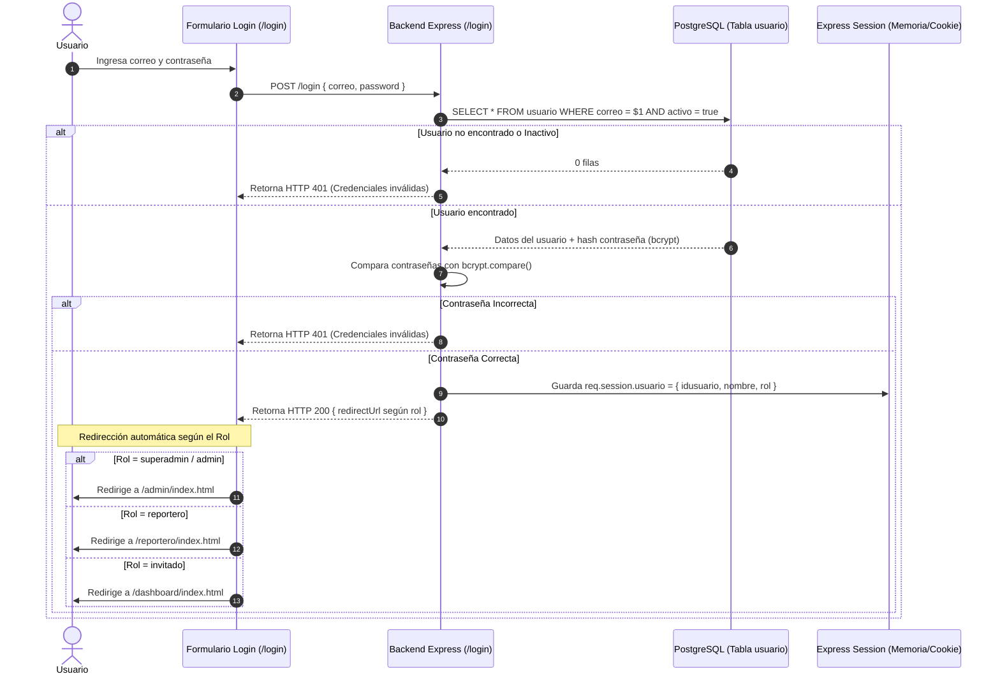

# 🔑 Módulo 01: Autenticación, Roles (RBAC) y Gestión de Usuarios

[⬅️ Volver al Índice General de Documentación](./README.md)

---

## 📌 1. Descripción del Módulo

El Módulo de Autenticación y Usuarios gestiona el acceso seguro al sistema SIGI mediante **Control de Acceso Basado en Roles (RBAC - Role-Based Access Control)**. Garantiza que cada actor del sistema (Superadministrador, Administrador, Reportero e Invitado) tenga acceso estrictamente delimitado a las operaciones autorizadas.

---

## 👥 2. Matriz de Roles y Permisos (RBAC)

| Rol | Permisos y Capacidades | Vistas Autorizadas |
| :--- | :--- | :--- |
| **`superadmin`** | Control total del sistema: Gestión de usuarios, cambio de roles, eliminación de incidentes, parametrización de catálogos y auditoría. | Mesa de Control Admin completa + Panel de Usuarios. |
| **`admin`** | Verificación de reportes, toma de control de incidentes en cola (*Takeover*), cambio de estados, consulta de analítica. | Mesa de Control Admin. |
| **`reportero`** | Registro de incidentes en terreno con GPS y foto de evidencia, consulta de sus propios reportes enviados. | App Móvil del Reportero (`/reportero/index.html`). |
| **`invitado`** | Consulta de incidentes verificados y mapa térmico público (solo lectura). | Dashboard de Invitados (`/dashboard/index.html`). |

---

## 🔄 3. Diagrama de Secuencia: Flujo de Inicio de Sesión (Login)



---

## 🗄️ 4. Esquema de Base de Datos (Tabla `usuario` y `rol`)

### Tabla `usuario`
```sql
CREATE TABLE usuario (
    idusuario SERIAL PRIMARY KEY,
    nombre VARCHAR(100) NOT NULL,
    apellido VARCHAR(100),
    correo VARCHAR(150) UNIQUE NOT NULL,
    password VARCHAR(255) NOT NULL,
    rol VARCHAR(30) DEFAULT 'reportero' CHECK (rol IN ('superadmin', 'admin', 'reportero', 'invitado')),
    telefono VARCHAR(20),
    activo BOOLEAN DEFAULT true,
    fecharegistro TIMESTAMP DEFAULT CURRENT_TIMESTAMP
);
```

---

## 📡 5. Endpoints de la API

### `POST /login`
Inicia sesión y genera la cookie de sesión cifrada.
* **Cuerpo JSON:** `{ "correo": "admin@sigi.gov.co", "password": "123" }`
* **Respuesta Exitosa (HTTP 200):** `{ "mensaje": "Inicio de sesión exitoso", "rol": "admin", "redirect": "/admin/index.html" }`

### `GET /logout`
Destruye la sesión activa y limpia la cookie.

### `GET /api/usuarios` (Solo `superadmin`)
Retorna la lista de usuarios con opción de filtrado por estado activo/inactivo.

### `PUT /api/usuarios/:id` (Solo `superadmin`)
Actualiza el rol o desactiva la cuenta de un usuario.
