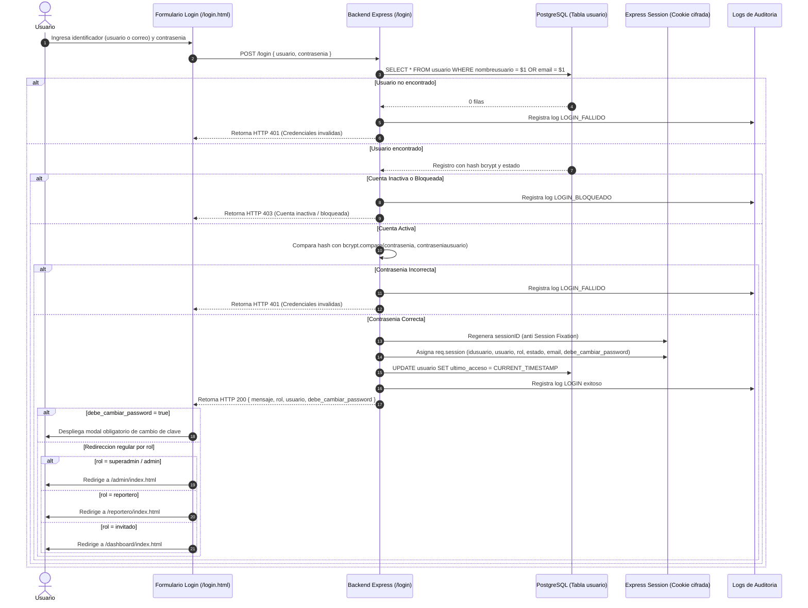

# Modulo 01: Autenticacion, Roles (RBAC) y Gestion de Usuarios

[Volver al Indice General de Documentacion](./README.md)

---

## 1. Descripcion del Modulo

El Modulo de Autenticacion y Usuarios gestiona el acceso seguro al sistema SIGI mediante **Control de Acceso Basado en Roles (RBAC - Role-Based Access Control)**. Garantiza que cada actor del sistema (Superadministrador, Administrador, Reportero e Invitado) tenga acceso estrictamente delimitado a las operaciones autorizadas, protegiendo la confidencialidad e integridad de la informacion geoespacial.

---

## 2. Matriz de Roles y Permisos (RBAC)

| Rol | Permisos y Capacidades | Vistas Autorizadas |
| :--- | :--- | :--- |
| **superadmin** | Control total de gobernanza: Creacion, modificacion y suspension de usuarios, asignacion de roles, auditoria forense de logs del sistema, parametrizacion de catalogos y liberacion forzosa de bloqueos concurrentes. | Consola Administrativa (`/admin/index.html`) con modulo de usuarios y logs activo. |
| **admin** | Mesa de validacion operativa: Revision de reportes de campo en cola compartida, adquisicion de candados de concurrencia (lock de 10 min), aprobacion, desestimacion y edicion de incidentes, importacion masiva CSV con rollback y consulta de analitica. | Consola Administrativa (`/admin/index.html`). |
| **reportero** | Operacion en terreno: Levantamiento de incidentes con geolocalizacion automatica por GPS, captura y transmision de evidencia fotografica optimizada, seguimiento de radicados en "Mis Reportes". | Aplicacion Movil del Reportero (`/reportero/index.html`). |
| **invitado** | Consulta ciudadana abierta: Visualizacion de incidentes aprobados en mapa interactivo (clustering y mapa de calor), consulta de tableros de analitica descriptiva, aplicacion de filtros espacio-temporales y recuperacion de acceso. | Geoportal Publico / Dashboard (`/dashboard/index.html`). |

---

## 3. Diagrama de Secuencia: Flujo de Inicio de Sesion (Login)


```mermaid
sequenceDiagram
    autonumber
    actor U as Usuario
    participant F as Formulario Login (/login.html)
    participant B as Backend Express (/login)
    participant DB as PostgreSQL (Tabla usuario)
    participant S as Express Session (Cookie cifrada)
    participant A as Logs de Auditoria

    U->>F: Ingresa identificador (usuario o correo) y contrasenia
    F->>B: POST /login { usuario, contrasenia }
    B->>DB: SELECT * FROM usuario WHERE nombreusuario = $1 OR email = $1

    alt Usuario no encontrado
        DB-->>B: 0 filas
        B->>A: Registra log LOGIN_FALLIDO
        B-->>F: Retorna HTTP 401 (Credenciales invalidas)
    else Usuario encontrado
        DB-->>B: Registro con hash bcrypt y estado
        
        alt Cuenta Inactiva o Bloqueada
            B->>A: Registra log LOGIN_BLOQUEADO
            B-->>F: Retorna HTTP 403 (Cuenta inactiva / bloqueada)
        else Cuenta Activa
            B->>B: Compara hash con bcrypt.compare(contrasenia, contraseniausuario)
            
            alt Contrasenia Incorrecta
                B->>A: Registra log LOGIN_FALLIDO
                B-->>F: Retorna HTTP 401 (Credenciales invalidas)
            else Contrasenia Correcta
                B->>S: Regenera sessionID (anti Session Fixation)
                B->>S: Asigna req.session (idusuario, usuario, rol, estado, email, debe_cambiar_password)
                B->>DB: UPDATE usuario SET ultimo_acceso = CURRENT_TIMESTAMP
                B->>A: Registra log LOGIN exitoso
                B-->>F: Retorna HTTP 200 { mensaje, rol, usuario, debe_cambiar_password }
                
                alt debe_cambiar_password = true
                    F->>U: Despliega modal obligatorio de cambio de clave
                else Redireccion regular por rol
                    alt rol = superadmin / admin
                        F->>U: Redirige a /admin/index.html
                    else rol = reportero
                        F->>U: Redirige a /reportero/index.html
                    else rol = invitado
                        F->>U: Redirige a /dashboard/index.html
                    end
                end
            end
        end
    end
```

---

## 4. Esquema de Base de Datos (Tabla `usuario`)

La persistencia de identidades en PostgreSQL implementa control de auditoria y trazabilidad:

```sql
CREATE TABLE public.usuario (
    idusuario serial NOT NULL,
    nombreusuario character varying(50) NOT NULL UNIQUE,
    contraseniausuario character varying(255) NOT NULL,
    entidadusuario character varying(100) NOT NULL,
    email character varying(150),
    rol character varying(20) DEFAULT 'reportero' 
        CHECK (rol IN ('superadmin', 'admin', 'reportero', 'invitado')),
    estado character varying(20) DEFAULT 'activo' 
        CHECK (estado IN ('activo', 'inactivo', 'bloqueado')),
    email_verificado boolean DEFAULT false,
    dependencia character varying(100),
    telefono character varying(20),
    foto_perfil text,
    ultimo_acceso timestamp without time zone,
    debe_cambiar_password boolean DEFAULT false,
    fecha_registro timestamp without time zone DEFAULT CURRENT_TIMESTAMP,
    created_by integer REFERENCES public.usuario(idusuario),
    fecha_actualizacion timestamp without time zone DEFAULT CURRENT_TIMESTAMP,
    CONSTRAINT usuario_pkey PRIMARY KEY (idusuario)
);
```

---

## 5. Endpoints de la API

### Autenticacion y Sesion

#### `POST /login`
Inicia sesion mediante usuario o correo electronico. Aplica rate limiting (maximo 5 intentos fallidos en 15 minutos).
* **Cuerpo JSON:**
```json
{
  "usuario": "admin_central",
  "contrasenia": "ClaveSegura2026"
}
```
* **Respuesta Exitosa (HTTP 200):**
```json
{
  "mensaje": "Login correcto",
  "rol": "admin",
  "usuario": "admin_central",
  "debe_cambiar_password": false
}
```

#### `GET /logout`
Destruye la sesion activa en el servidor y limpia la cookie de sesion del navegador.
* **Respuesta Exitosa (HTTP 200 / Redireccion):** Redirige a `/login.html`.

#### `GET /usuario`
Retorna el estado de la sesion actual del usuario logueado.
* **Respuesta Exitosa (HTTP 200):**
```json
{
  "idusuario": 2,
  "usuario": "admin_central",
  "rol": "admin",
  "estado": "activo",
  "email": "admin@florencia.gov.co",
  "dependencia": "Secretaria de Gobierno",
  "debe_cambiar_password": false
}
```

#### `POST /api/auth/recuperar-password`
Solicita un enlace temporal firmado para restablecer la credencial de acceso ante olvido.
* **Cuerpo JSON:** `{ "email": "funcionario@florencia.gov.co" }`
* **Respuesta Exitosa (HTTP 200):** `{ "mensaje": "Se ha enviado un correo con instrucciones para restablecer tu contrasenia." }`

#### `GET /api/auth/validar-token-reset`
Valida la vigencia y no utilizacion del token temporal recibido por correo (validez de 1 hora).
* **Parametros Query:** `?token=<token_hex>`
* **Respuesta Exitosa (HTTP 200):** `{ "valido": true, "email": "funcionario@florencia.gov.co" }`

#### `POST /api/auth/reset-password`
Aplica el cambio definitivo de contrasenia utilizando el token previamente validado.
* **Cuerpo JSON:** `{ "token": "<token_hex>", "nuevaContrasenia": "NuevaClave2026" }`
* **Respuesta Exitosa (HTTP 200):** `{ "mensaje": "Contrasenia restablecida exitosamente." }`

#### `POST /api/auth/cambiar-password-primer-ingreso`
Permite al usuario actualizar la credencial asignada provisionalmente por el Superadministrador en su primer ingreso.
* **Cuerpo JSON:** `{ "nuevaContrasenia": "ClavePersonal2026" }`
* **Respuesta Exitosa (HTTP 200):** `{ "mensaje": "Contrasenia actualizada correctamente." }`

---

### Administracion de Usuarios (Exclusivo Superadmin)

Todas las siguientes rutas requieren sesion autenticada y pertenencia al rol `superadmin`:

#### `GET /api/usuarios`
Lista el directorio completo de usuarios con soporte de filtrado por rol y estado.

#### `POST /api/usuarios`
Crea una nueva cuenta de usuario. Genera una contrasenia provisional segura, registra al usuario con la marca `debe_cambiar_password = true` y despacha automaticamente un correo institucional con las credenciales de acceso.

#### `PUT /api/usuarios/:id`
Actualiza datos de perfil institucional: entidad, dependencia, telefono y correo.

#### `PATCH /api/usuarios/:id/estado`
Modifica el estado operativo de la cuenta (`activo`, `inactivo`, `bloqueado`). Si se desactiva un usuario con sesion abierta, los middlewares de seguridad deniegan cualquier operacion subsiguiente.

#### `DELETE /api/usuarios/:id`
Elimina un usuario del sistema (o aplica borrado logico segun integridad referencial).

#### `GET /api/usuarios/auditoria/logs`
Consulta la bitacora forense de auditoria (`logs_actividad`), permitiendo filtrar por usuario, tipo de accion, rango de fechas e IP de origen.
