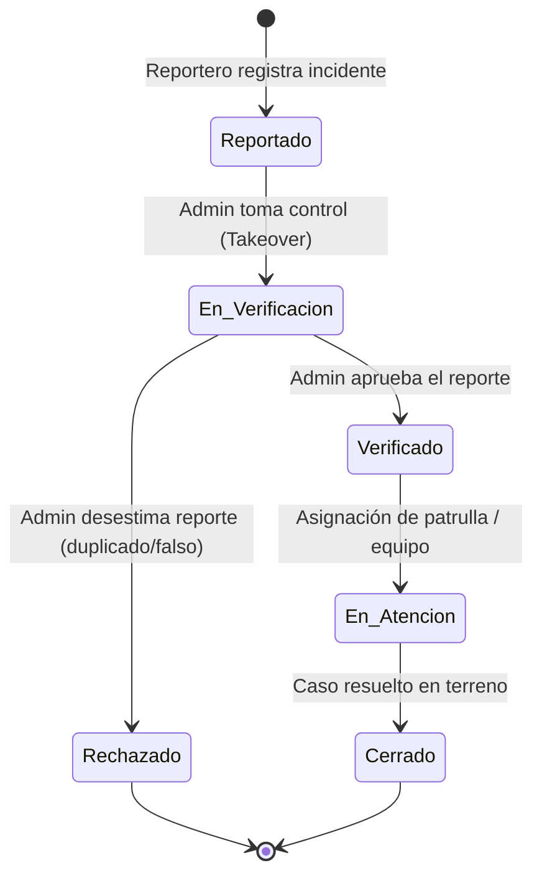
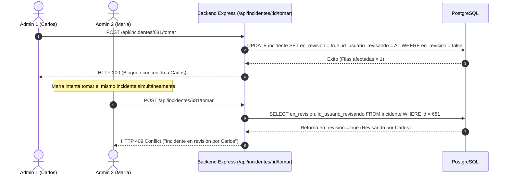

# 🚨 Módulo 02: Registro de Incidentes y Cola Compartida (Shared Queue & Takeover)

[⬅️ Volver al Índice General de Documentación](./README.md)

---

## 📌 1. Descripción del Módulo

Este módulo gestiona la captura, validación y ciclo de vida operacional de los reportes de incidentes. Incluye la **Cola Compartida con Toma de Control (Takeover)**, un mecanismo diseñado para evitar conflictos de edición concurrente cuando múltiples administradores verifican incidentes simultáneamente en el territorio.

---

## 🔄 2. Ciclo de Vida del Incidente

Todo incidente pasa por los siguientes estados dentro de su flujo de atención:



---

## 🔒 3. Mecanismo de Bloqueo Atómico (Shared Queue & Takeover)

### Problema Resuelto:
Cuando 3 administradores abren el dashboard al mismo tiempo, el sistema debe evitar que dos administradores aprueben o modifiquen la gravedad del mismo incidente simultáneamente.

### Solución Implementada:
1. **Atenticidad de Bloqueo:** Cuando un Admin presiona "Atender / Verificar Incidente", el servidor ejecuta una consulta atómica en la BD PostgreSQL marcando:
   * `en_revision = true`
   * `id_usuario_revisando = id_admin_actual`
   * `fecha_inicio_revision = NOW()`
2. **Indicador Visual en Tiempo Real:** Para los demás administradores, el incidente aparece resaltado en la tabla como 🔒 **"En revisión por [Nombre Admin]"**, deshabilitando los botones de acción.
3. **Liberación Automática / Toma de Control:** Si un administrador abandona la sesión o pasa más de 15 minutos inactivas, otro administrador puede solicitar la **Toma de Control (Takeover)** para desbloquear el registro.

---

## 📊 4. Diagrama de Secuencia del Bloqueo Atómico



---

## 🗄️ 5. Campos Clave en la Tabla `incidente`

```sql
ALTER TABLE incidente ADD COLUMN IF NOT EXISTS en_revision BOOLEAN DEFAULT false;
ALTER TABLE incidente ADD COLUMN IF NOT EXISTS id_usuario_revisando INT REFERENCES usuario(idusuario);
ALTER TABLE incidente ADD COLUMN IF NOT EXISTS fecha_inicio_revision TIMESTAMP;
```

---

## 📡 6. Endpoints de la API

| Método | Ruta | Descripción | Roles Autorizados |
| :--- | :--- | :--- | :--- |
| `POST` | `/api/incidentes` | Registrar nuevo incidente con foto (`multipart/form-data`) | `reportero`, `admin`, `superadmin` |
| `GET` | `/incidentesFiltroAdmin` | Consultar cola compartida con filtros y estado de revisión | `admin`, `superadmin` |
| `POST` | `/api/incidentes/:id/tomar` | Adquirir el bloqueo atómico del incidente | `admin`, `superadmin` |
| `POST` | `/api/incidentes/:id/liberar` | Liberar el bloqueo del incidente | `admin`, `superadmin` |
| `PUT` | `/api/incidentes/:id/estado` | Cambiar estado (Verificado, Rechazado, Cerrado) | `admin`, `superadmin` |
