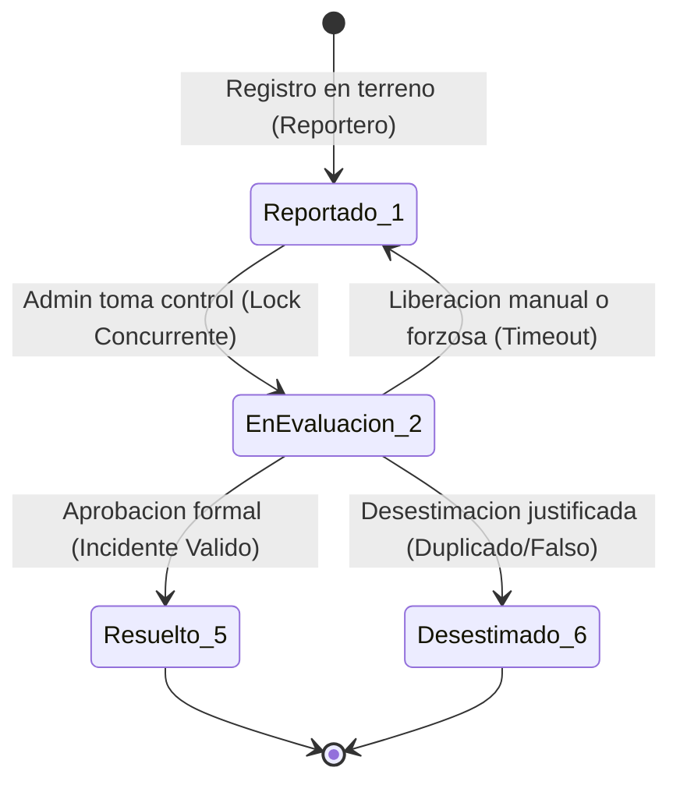
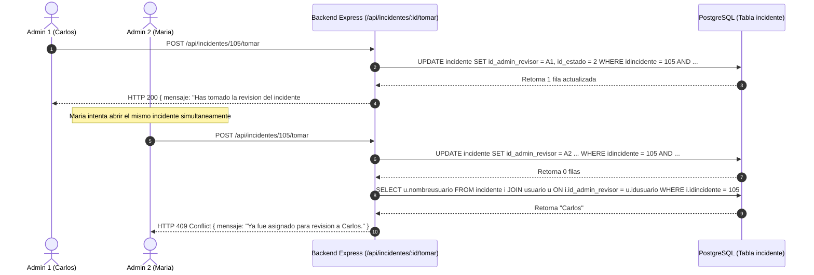

# Modulo 02: Registro de Incidentes y Cola Compartida (Shared Queue & Takeover)

[Volver al Indice General de Documentacion](./README.md)

---

## 1. Descripcion del Modulo

Este modulo gestiona la captura, validacion y ciclo de vida operacional de los reportes de incidentes. Incluye la **Cola Compartida con Toma de Control (Takeover y Candado Concurrente)**, un mecanismo disenado para prevenir colisiones operativas y evitar que multiples analistas dictaminen o modifiquen el mismo incidente en simultaneo.

---

## 2. Ciclo de Vida del Incidente

El flujo del incidente esta regulado por identificadores numericos de estado (`id_estado`):


```mermaid
stateDiagram-v2
    [*] --> Reportado_1 : Registro en terreno (Reportero)
    Reportado_1 --> EnEvaluacion_2 : Admin toma control (Lock Concurrente)
    EnEvaluacion_2 --> Resuelto_5 : Aprobacion formal (Incidente Valido)
    EnEvaluacion_2 --> Desestimado_6 : Desestimacion justificada (Duplicado/Falso)
    EnEvaluacion_2 --> Reportado_1 : Liberacion manual o forzosa (Timeout)
    Resuelto_5 --> [*]
    Desestimado_6 --> [*]
```

### Tabla de Estados de Incidente

| ID | Nombre de Estado | Descripcion Operativa | Visible en Dashboard Publico |
| :---: | :--- | :--- | :---: |
| **1** | **Reportado** | Novedad ingresada por reportero; permanece en la cola compartida a la espera de revision. | No |
| **2** | **En evaluacion** | Un administrador ha abierto el caso adquiriendo el candado exclusivo de revision. | No |
| **3** | **Asignado** | Caso canalizado internamente a una dependencia operativa. | No |
| **4** | **En proceso** | Caso en atencion fisica por cuadrilla, policia o bomberos. | No |
| **5** | **Resuelto / Aprobado** | Incidente verificado tecnicamente y publicado para consulta ciudadana y estadisticas. | Si |
| **6** | **Cerrado sin resolver** | Incidente desestimado con consignacion obligatoria de motivo en bitacora. | No |

---

## 3. Mecanismo de Bloqueo Concurrente (Atomic Lock & Takeover)

### Problema Resuelto
En situaciones de alta actividad territorial, multiples analistas de seguridad acceden a la consola administrativa simultaneamente. Sin un protocolo de exclusion mutua, dos analistas podrian emitir dictamenes contradictorios sobre el mismo reporte.

### Protocolo de Bloqueo Implementado
1. **Adquisicion Atomica:** Al abrir la ficha de revision, el backend ejecuta una sentencia atomica en PostgreSQL:
   ```sql
   UPDATE incidente
   SET id_admin_revisor = $1,
       id_estado = 2,
       fecha_toma_revision = CURRENT_TIMESTAMP
   WHERE idincidente = $2
     AND (id_admin_revisor IS NULL OR id_admin_revisor = $1 OR id_estado = 1)
   RETURNING idincidente, codigoincidente, id_estado, id_admin_revisor;
   ```
2. **Respuesta ante Colision:** Si la consulta afecta 0 filas, el servidor consulta la identidad del revisor actual y retorna inmediatamente un error **HTTP 409 Conflict** indicando que el incidente se encuentra bajo revision activa.
3. **Liberacion Ordinaria:** Tras concluir la aprobacion o rechazo, o al presionar "Volver a la cola", el candado se libera:
   ```sql
   UPDATE incidente
   SET id_admin_revisor = NULL,
       id_estado = 1,
       fecha_toma_revision = NULL
   WHERE idincidente = $1 AND id_admin_revisor = $2;
   ```
4. **Liberacion por Superadministrador (Takeover):** Si un analista retiene indebidamente un caso, el Superadministrador posee privilegios para forzar la liberacion del candado independientemente de quien sea el titular actual.

---

## 4. Diagrama de Secuencia del Bloqueo Concurrente


```mermaid
sequenceDiagram
    autonumber
    actor A1 as Admin 1 (Carlos)
    actor A2 as Admin 2 (Maria)
    participant B as Backend Express (/api/incidentes/:id/tomar)
    participant DB as PostgreSQL (Tabla incidente)

    A1->>B: POST /api/incidentes/105/tomar
    B->>DB: UPDATE incidente SET id_admin_revisor = A1, id_estado = 2 WHERE idincidente = 105 AND ...
    DB-->>B: Retorna 1 fila actualizada
    B-->>A1: HTTP 200 { mensaje: "Has tomado la revision del incidente #105" }

    Note over A2: Maria intenta abrir el mismo incidente simultaneamente
    A2->>B: POST /api/incidentes/105/tomar
    B->>DB: UPDATE incidente SET id_admin_revisor = A2 ... WHERE idincidente = 105 AND ...
    DB-->>B: Retorna 0 filas
    B->>DB: SELECT u.nombreusuario FROM incidente i JOIN usuario u ON i.id_admin_revisor = u.idusuario WHERE i.idincidente = 105
    DB-->>B: Retorna "Carlos"
    B-->>A2: HTTP 409 Conflict { mensaje: "Ya fue asignado para revision a Carlos." }
```

---

## 5. Columnas de Control Concurrente en PostgreSQL

Las siguientes columnas soportan el protocolo de concurrencia y clasificacion:

```sql
ALTER TABLE public.incidente
    ADD COLUMN IF NOT EXISTS id_admin_revisor integer REFERENCES public.usuario(idusuario),
    ADD COLUMN IF NOT EXISTS fecha_toma_revision timestamp without time zone,
    ADD COLUMN IF NOT EXISTS id_estado integer REFERENCES public.estado_incidente(id_estado),
    ADD COLUMN IF NOT EXISTS id_gravedad integer REFERENCES public.gravedad_incidente(id_gravedad),
    ADD COLUMN IF NOT EXISTS id_modalidad integer REFERENCES public.modalidad_incidente(id_modalidad),
    ADD COLUMN IF NOT EXISTS id_usuario_editor integer REFERENCES public.usuario(idusuario),
    ADD COLUMN IF NOT EXISTS fecha_edicion timestamp without time zone;
```

---

## 6. Endpoints de la API

| Metodo | Ruta | Descripcion | Perfiles Autorizados |
| :--- | :--- | :--- | :--- |
| `POST` | `/api/incidentes` | Registrar nuevo incidente con o sin evidencia fotografica (`multipart/form-data`) | `reportero`, `admin`, `superadmin` |
| `GET` | `/api/incidentes/pendientes` | Listar incidentes en estado 1 (Reportado) y 2 (En evaluacion) para la mesa de validacion | `admin`, `superadmin` |
| `GET` | `/api/incidentes/mis-reportes` | Consultar el historico de incidentes radicados por el usuario autenticado | `reportero`, `admin`, `superadmin` |
| `POST` | `/api/incidentes/:id/tomar` | Adquirir el candado de concurrencia para iniciar revision exclusiva | `admin`, `superadmin` |
| `POST` | `/api/incidentes/:id/liberar` | Devolver el incidente a la cola compartida con estado 1 (Reportado) | `admin`, `superadmin` |
| `POST` | `/api/incidentes/:id/resolver` | Dictaminar caso como verificado y aprobado (id_estado = 5) | `admin`, `superadmin` |
| `POST` | `/api/incidentes/:id/cerrar` | Desestimar o rechazar el caso consignando motivo (id_estado = 6) | `admin`, `superadmin` |
| `DELETE` | `/api/incidentes/:id` | Eliminar registro (valida que reportero solo borre sus propios casos en estado 1) | `reportero`, `admin`, `superadmin` |
| `POST` | `/importar-incidentes` | Carga masiva transaccional en streaming de ficheros CSV con calculo de lote | `admin`, `superadmin` |
| `DELETE` | `/importados/ultimo` | Rollback de la ultima importacion masiva ejecutada | `admin`, `superadmin` |
