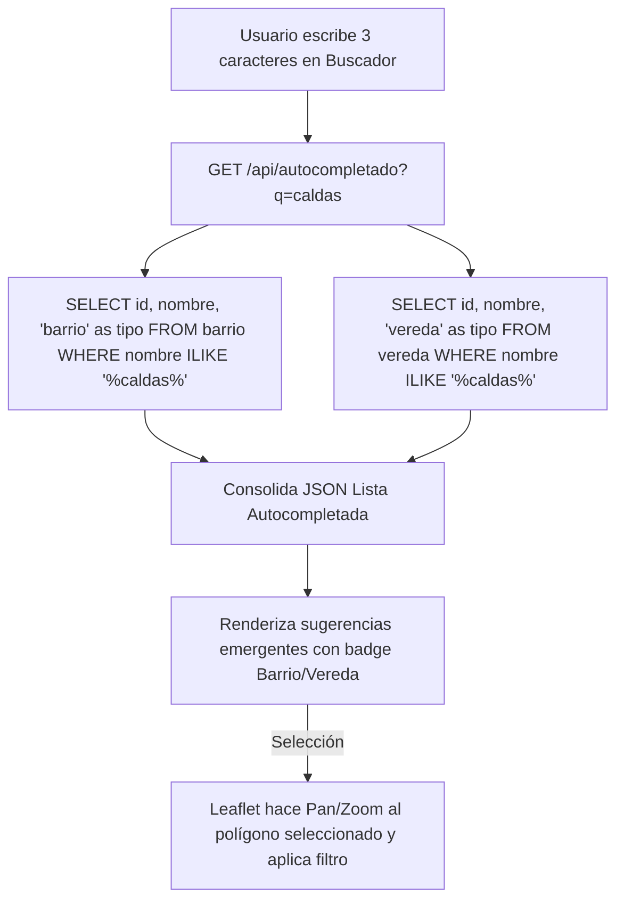

# 🗺️ Módulo 03: Motor Geoespacial PostGIS & Mapas Interactivos (Leaflet)

[⬅️ Volver al Índice General de Documentación](./README.md)

---

## 📌 1. Descripción del Módulo

El Módulo Geoespacial procesa y georreferencia las coordenadas latitud/longitud de los incidentes en el sistema de coordenadas **SRID 4326 (WGS84)**. Mediante la extensión espacial **PostGIS**, realiza la identificación automática del polígono urbano (Barrio) o rural (Vereda) donde ocurrió el evento mediante análisis espacial de punto en polígono (`ST_Contains`).

---

## 🗺️ 2. Arquitectura de Mapas (Leaflet.js & Capas GeoJSON)

El frontend utiliza **Leaflet.js** para el despliegue del mapa interactivo con soporte de dos capas poligonales geográficas:

1. **Capa Urbana (Barrios):** Polígonos vectoriales GeoJSON con los límites político-administrativos de la zona urbana.
2. **Capa Rural (Veredas):** Polígonos vectoriales GeoJSON para la zona rural y corregimientos.
3. **Capa de Marcadores (Clustering & Heatmap):** Representación de incidentes con iconos personalizados según la gravedad (Alta: 🔴, Media: 🟡, Baja: 🟢).

---

## 📐 3. Consultas Espaciales PostGIS (`ST_Contains`)

Cuando se registra un incidente con coordenadas `(lng, lat)`, el servidor no le pide al usuario que adivine el barrio. En su lugar, PostGIS ejecuta automáticamente las consultas espaciales en milisegundos:

```sql
-- 1. Buscar si la coordenada cae dentro de un Barrio (Urbano)
SELECT id FROM barrio 
WHERE ST_Contains(geom, ST_SetSRID(ST_MakePoint($1, $2), 4326)) 
LIMIT 1;

-- 2. Si no es un barrio, buscar en Vereda (Rural)
SELECT id FROM vereda 
WHERE ST_Contains(geom, ST_SetSRID(ST_MakePoint($1, $2), 4326)) 
LIMIT 1;
```

---

## 🔍 4. Componente de Buscador & Autocompletado Unificado

Se implementó un componente de búsqueda inteligente que consolida en un solo campo la búsqueda de Barrios, Veredas y Puntos de Referencia:



---

## 📡 5. Endpoints Geoespaciales API

### `GET /capas/barrios`
Devuelve el GeoJSON completo de la capa de barrios para su renderizado en Leaflet.

### `GET /capas/veredas`
Devuelve el GeoJSON completo de la capa de veredas.

### `GET /api/autocompletado?q=:query`
Busca coincidencias dinámicas de nombres de barrios y veredas para la barra de búsqueda del dashboard.
