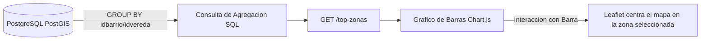

# Modulo 04: Analitica, Indicadores KPI e Importacion Masiva CSV

[Volver al Indice General de Documentacion](./README.md)

---

## 1. Descripcion del Modulo

El Modulo de Analitica transforma la informacion espacial y temporal persistida en la base de datos en informacion estrategica para la toma de decisiones institucionales. Provee tableros de control con **Indicadores Clave de Desempeno (KPIs)**, distribucion por tipologias, rankings de **Top Zonas Criticas** y un motor transaccional de **Importacion Masiva CSV** con capacidad de reversión atómica de lotes (*Undo*).

---

## 2. Tarjetas KPI y Metricas de Contexto

El panel analitico calcula dinamicamente las siguientes metricas operativas y ciudadanas:

1. **Total de Incidentes Registrados:** Conteo consolidado segun filtros espacio-temporales aplicados.
2. **Variacion Mensual Comparativa:**
   - Compara el volumen de incidentes del mes seleccionado frente al mes inmediatamente anterior.
   - Genera el diferencial porcentual para detectar patrones de incremento o reduccion:
     - Formula: `((Incidentes_Mes_Actual - Incidentes_Mes_Anterior) / Incidentes_Mes_Anterior) * 100`
3. **Distribucion por Gravedad y Tipologia:** Segmentacion por niveles de afectacion comunitaria y modalidades delictivas o accidentales.
4. **Ultima Fecha de Actualizacion:** Marca temporal del ultimo evento radicado o validado en la plataforma.

---

## 3. Zonas Criticas y Distribucion Espacial

Permite identificar los sectores urbanos (barrios) y rurales (veredas) con mayor frecuencia de eventos para focalizar recursos de vigilancia y prevencion:



---

## 4. Motor de Importacion Masiva CSV y Reversion (Undo)

Para integrar historiales consolidados o fuentes externas (Policia Nacional, Defensa Civil, Bomberos), el sistema provee ingesta masiva en streaming:

### Estructura Requerida del Archivo CSV:
* Encabezados obligatorios: `tipo, fecha, hora, latitud, longitud, descripcion`
* Campos opcionales: `direccion, gravedad, modalidad, victimas, vehiculos, perdidas`

### Protocolo Transaccional por Lotes:
1. Al iniciar la carga via `POST /importar-incidentes`, se calcula un identificador secuencial de lote (`id_lote`).
2. Las coordenadas geograficas se parsean y se validan en el rango de Florencia (WGS84).
3. PostGIS autocalcula la pertenencia a barrios y veredas mediante `ST_Contains`.
4. Los incidentes se insertan con `origen = 'masivo'` y `id_lote`.
5. Se consigna el resultado en `logs_actividad` detallando exitos y descartes.

### Mecanismo de Reversion Atomica (Deshacer Importacion):
Si un analista detecta inconsistencias en el fichero subido:
```sql
-- Elimina los incidentes pertenecientes exclusivamente al ultimo lote masivo
DELETE FROM public.incidente 
WHERE origen = 'masivo' AND id_lote = $1;
```

---

## 5. Endpoints de la API Analitica e Importacion

| Metodo | Ruta | Descripcion | Perfiles Autorizados |
| :--- | :--- | :--- | :--- |
| `GET` | `/resumen` | Retorna totales consolidados de incidentes, tipos y zonas | Publico (`invitado`, `reportero`, `admin`, `superadmin`) |
| `GET` | `/conteoIncidente` | Total de incidentes aprobados registrados en el sistema | Publico |
| `GET` | `/conteoPorTipo` | Agrupacion de incidentes clasificados por tipo (`nametipoincidente`) | Publico |
| `GET` | `/top-zonas` | Ranking de las 10 zonas urbanas y rurales con mayor concentracion de eventos | Publico |
| `GET` | `/top-incidentes` | Ranking de las tipologias de incidentes con mayor recurrencia | Publico |
| `GET` | `/ultima-actualizacion` | Retorna la fecha y hora del reporte mas reciente procesado | Publico |
| `POST` | `/importar-incidentes` | Carga de archivo CSV (`multipart/form-data`) con ingesta por lote | `admin`, `superadmin` |
| `DELETE` | `/importados/ultimo` | Revierte la totalidad de registros del ultimo lote importado | `admin`, `superadmin` |
