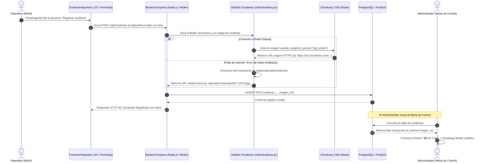
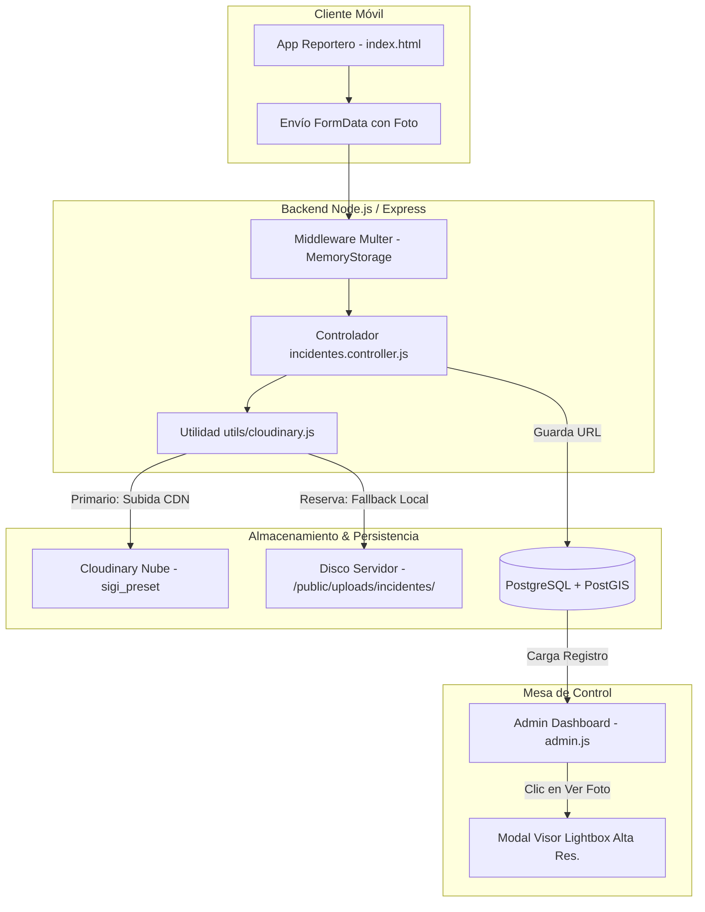

# 📸 Módulo 05: Servicio de Evidencia Fotográfica con Cloudinary CDN

[⬅️ Volver al Índice General de Documentación](./README.md)

---

## 📌 1. Introducción y Justificación Técnica

El módulo de evidencia fotográfica permite a los **Reporteros de Campo** adjuntar capturas fotográficas en tiempo real al registrar incidentes en el territorio. 

### ¿Por qué Cloudinary?
1. **Descarga de Servidor VPS / Local:** Guardar imágenes pesadas en el servidor local de la entidad satura el disco duro y reduce la velocidad del sistema.
2. **Red de Distribución CDN:** Cloudinary distribuye y optimiza automáticamente la resolución de las fotos según el dispositivo que la consulta.
3. **Escalabilidad y Seguridad:** Garantiza URLs públicas HTTPS protegidas y organizadas por carpetas (`sigi_incidentes`).

---

## 🔄 2. Diagrama de Secuencia del Flujo (End-to-End)

El siguiente diagrama ilustra el recorrido completo desde la captura en el dispositivo móvil del reportero hasta la visualización en la Mesa de Control del Administrador:



---

## 🏗️ 3. Diagrama de Arquitectura de Componentes



---

## 🛡️ 4. Mecanismo de Resiliencia (Tolerancia a Fallos / Fallback Local)

El sistema cuenta con una arquitectura resiliente para garantizar **disponibilidad del 100%**, previniendo la pérdida de reportes si se agota el paquete de datos del móvil o si la API de la nube no responde:

| Estado de la Nube | Acción del Sistema | Resultado en Base de Datos |
| :--- | :--- | :--- |
| **Nube Disponible (Online)** | Sube a Cloudinary con `sigi_preset` | `imagen_url = 'https://res.cloudinary.com/...'` |
| **Nube Inaccesible / Sin Red** | Guarda copia local en `/public/uploads/incidentes/` | `imagen_url = '/uploads/incidentes/INC-XXXXXX.jpg'` |

---

## ⚙️ 5. Variables de Entorno y Configuración (`.env`)

Para conectar el servicio con tu cuenta de Cloudinary, se requieren las siguientes variables en el archivo `.env`:

```env
# CLOUDINARY CONFIG
CLOUDINARY_CLOUD_NAME=jhstpfiw
CLOUDINARY_API_KEY=287989477625174
CLOUDINARY_API_SECRET=S0wJrzPVRXgkJg7HUbCW7FBLI_o
CLOUDINARY_UPLOAD_PRESET=sigi_preset
```

---

## 📡 6. Especificación del Endpoint API

### `POST /api/incidentes`
* **Tipo de Contenido:** `multipart/form-data`
* **Respuesta Exitosa (HTTP 201 Created):**
```json
{
  "mensaje": "Incidente registrado exitosamente",
  "incidente": {
    "idincidente": 681,
    "codigoincidente": "RO0109261805A0681",
    "imagen_url": "https://res.cloudinary.com/jhstpfiw/image/upload/v1788305406/sigi_incidentes/INC-RO0109261805A0681.png"
  }
}
```
