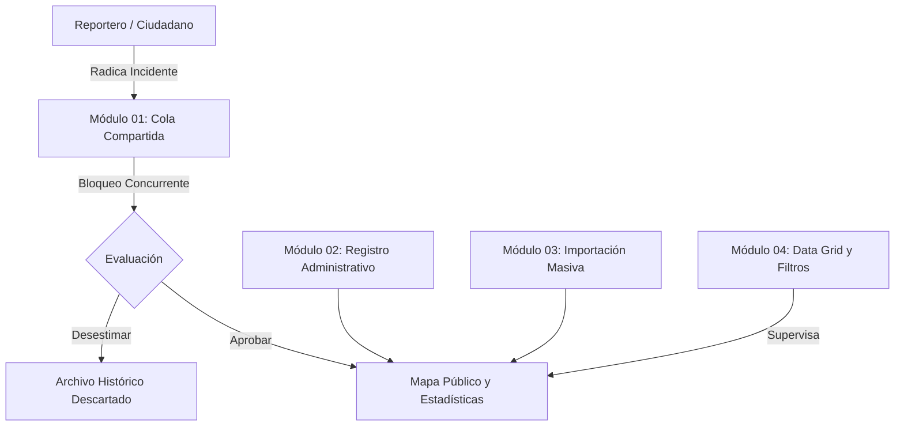

# Documentación del Rol: Admin (Analista y Validador)

El rol **Admin** comprende a los analistas de seguridad, operadores del centro de comando y monitoreo (CAD / C4) y coordinadores operativos encargados de la verificación de incidentes, depuración cartográfica y enriquecimiento de la información territorial.

---

## 🏛️ Flujo Operativo y Dependencias

---

## 📚 Índice de Módulos y Diagramas

| Módulo | Descripción Técnica | Diagrama Asociado |
| :--- | :--- | :--- |
| **[Módulo 01: Mesa de Validación y Cola Compartida](01_cola_compartida_validacion.md)** | Prevención de colisiones concurrentes mediante `bloqueado_por`, auto-desbloqueo por inactividad y resolución oficial de incidentes. | [`diagramas/01_cola_compartida_validacion.drawio`](diagramas/01_cola_compartida_validacion.drawio) |
| **[Módulo 02: Registro y Gestión Administrativa](02_registro_gestion_incidentes.md)** | Captura en mapa con geocodificación de barrios, doble visor cartográfico y CRUD de incidentes. | [`diagramas/02_registro_gestion_incidentes.drawio`](diagramas/02_registro_gestion_incidentes.drawio) |
| **[Módulo 03: Importación Masiva de Datos](03_importacion_masiva_datos.md)** | Carga por lotes de hojas Excel/CSV, transacciones atómicas y mecanismo de reversión / deshacer última carga. | [`diagramas/03_importacion_masiva_datos.drawio`](diagramas/03_importacion_masiva_datos.drawio) |
| **[Módulo 04: Explorador Tabular y Filtros Avanzados](04_tablas_filtros_avanzados.md)** | Cuadrícula de datos paginada con semaforización, búsqueda multicriterio y acciones directas sobre registros. | [`diagramas/04_tablas_filtros_avanzados.drawio`](diagramas/04_tablas_filtros_avanzados.drawio) |

---

## 🔐 Matriz de Permisos RBAC
- **Autorizado:** `/admin`, `/api/incidentes/pendientes`, `/api/incidentes/:id/tomar`, `/api/incidentes/:id/liberar`, `/api/incidentes/:id/resolver`, `/importar-incidentes`, `/importados/ultimo`.
- **Restringido:** No tiene acceso al Módulo de Usuarios (`/api/usuarios`) ni a los Logs de Auditoría (`/api/usuarios/auditoria/logs`), los cuales están reservados exclusivamente para el **Superadmin**.
