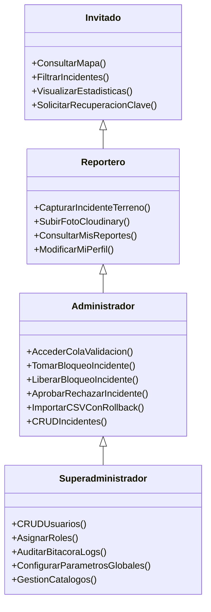

# ESPECIFICACIÓN DE REQUISITOS DE SOFTWARE (ERS)
## Sistema de Información Geográfica de Incidentes — SIGI
**Conforme al Estándar IEEE 830-1998**

---

### Control del Documento
- **Proyecto:** SIGI - Sistema de Información Geográfica de Incidentes
- **Entidad Patrocinadora:** Servicio Nacional de Aprendizaje (SENA)
- **Programa de Formación:** Análisis y Desarrollo de Software (ADSO) - Ficha 3142784
- **Autor / Desarrollador:** Daniel Felipe Vera Perdomo
- **Ubicación Geográfica:** Florencia, Caquetá, Colombia
- **Versión del Documento:** 2.0 (Actualizada integralmente con arquitectura multi-rol, Cloudinary y control concurrente)
- **Fecha de Emisión:** Septiembre 2026
- **Estado:** Versión Oficial Final

---

## ÍNDICE GENERAL

1. [INTRODUCCIÓN](#1-introducción)  
   1.1 [Propósito del Documento](#11-propósito-del-documento)  
   1.2 [Alcance del Producto](#12-alcance-del-producto)  
   1.3 [Personal Involucrado y Audiencia](#13-personal-involucrado-y-audiencia)  
   1.4 [Definiciones, Acrónimos y Abreviaturas](#14-definiciones-acrónimos-y-abreviaturas)  
   1.5 [Referencias Normativas y Técnicas](#15-referencias-normativas-y-técnicas)  
   1.6 [Resumen del Contenido](#16-resumen-del-contenido)  
2. [DESCRIPCIÓN GENERAL DEL SISTEMA](#2-descripción-general-del-sistema)  
   2.1 [Perspectiva del Producto](#21-perspectiva-del-producto)  
   2.2 [Funcionalidades Principales del Sistema](#22-funcionalidades-principales-del-sistema)  
   2.3 [Perfiles de Usuario y Modelo RBAC](#23-perfiles-de-usuario-y-modelo-rbac)  
   2.4 [Entorno Operativo y Tecnológico](#24-entorno-operativo-y-tecnológico)  
   2.5 [Restricciones de Diseño e Implementación](#25-restricciones-de-diseño-e-implementación)  
   2.6 [Supuestos y Dependencias](#26-supuestos-y-dependencias)  
3. [REQUISITOS ESPECÍFICOS DEL SISTEMA](#3-requisitos-específicos-del-sistema)  
   3.1 [Requisitos de Interfaces Externas](#31-requisitos-de-interfaces-externas)  
   3.2 [Módulo 1: Seguridad, Autenticación y Auditoría (AUTH-SEC)](#32-módulo-1-seguridad-autenticación-y-auditoría-auth-sec)  
   3.3 [Módulo 2: Georreferenciación y Visor Cartográfico (GIS-MAP)](#33-módulo-2-georreferenciación-y-visor-cartográfico-gis-map)  
   3.4 [Módulo 3: Captura Móvil en Terreno y Evidencia (REP-CAMPO)](#34-módulo-3-captura-móvil-en-terreno-y-evidencia-rep-campo)  
   3.5 [Módulo 4: Mesa de Validación y Bloqueo Concurrente (VAL-LOCK)](#35-módulo-4-mesa-de-validación-y-bloqueo-concurrente-val-lock)  
   3.6 [Módulo 5: Analítica Espacio-Temporal y Tableros KPI (KPI-ANL)](#36-módulo-5-analítica-espacio-temporal-y-tableros-kpi-kpi-anl)  
   3.7 [Módulo 6: Gestión Masiva de Datos y Rollback (DAT-MAS)](#37-módulo-6-gestión-masiva-de-datos-y-rollback-dat-mas)  
   3.8 [Módulo 7: Administración y Gobernanza de Usuarios (ADM-GOB)](#38-módulo-7-administración-y-gobernanza-de-usuarios-adm-gob)  
4. [REQUISITOS NO FUNCIONALES (RNF)](#4-requisitos-no-funcionales-rnf)  
   4.1 [Rendimiento y Capacidad](#41-rendimiento-y-capacidad)  
   4.2 [Seguridad y Protección de Datos](#42-seguridad-y-protección-de-datos)  
   4.3 [Disponibilidad y Concurrencia](#43-disponibilidad-y-concurrencia)  
   4.4 [Mantenibilidad y Portabilidad](#44-mantenibilidad-y-portabilidad)  
   4.5 [Usabilidad y Accesibilidad](#45-usabilidad-y-accesibilidad)  
5. [MATRIZ DE TRAZABILIDAD DE REQUISITOS](#5-matriz-de-trazabilidad-de-requisitos)  

---

## 1. INTRODUCCIÓN

### 1.1 Propósito del Documento
El presente documento define formalmente la **Especificación de Requisitos de Software (ERS)** para el **Sistema de Información Geográfica de Incidentes (SIGI)**, siguiendo la norma internacional **IEEE 830-1998**. Su objetivo primordial es servir como acuerdo vinculante entre los desarrolladores, evaluadores técnicos del SENA y los actores operativos involucrados en la gestión, visualización y análisis de eventos de seguridad y convivencia en el municipio de Florencia, Caquetá.

### 1.2 Alcance del Producto
SIGI es una plataforma WebGIS transaccional y analítica concebida para superar la fragmentación de la información de seguridad en Florencia. El sistema cubre:
- Captura de incidentes georreferenciados en campo por cuadrantes o agentes móviles, con coordenadas GNSS/WGS84 y anexión de fotografías procesadas y almacenadas en Cloudinary.
- Mesa de validación y control concurrente para analistas y administradores, impidiendo condiciones de carrera (*race conditions*) mediante bloqueo temporal y revisión de evidencia.
- Portal público e interactivo para la ciudadanía con mapas temáticos, capas de comunas, barrios y veredas, filtros espacio-temporales y tableros de analítica cívica.
- Panel de gobernanza, auditoría exhaustiva de operaciones en base de datos y administración granular de cuentas con autenticación segura y recuperación por token criptográfico vía correo.

### 1.3 Personal Involucrado y Audiencia
- **Desarrollador / Líder Técnico:** Daniel Felipe Vera Perdomo.
- **Instructores / Evaluadores SENA:** Equipo de evaluación del Centro de Formación (Programa ADSO).
- **Destinatarios Finales:** Ciudadanos de Florencia (Invitados), Agentes de campo (Reporteros), Analistas de seguridad (Administradores) y Jefes de sistemas (Superadministradores).

### 1.4 Definiciones, Acrónimos y Abreviaturas
- **ADSO:** Análisis y Desarrollo de Software.
- **API REST:** Interfaz de Programación de Aplicaciones basada en transferencia de estado representacional sobre HTTP/HTTPS.
- **Cloudinary:** Plataforma en la nube para ingesta, optimización, transformación y entrega de activos digitales multimedia.
- **EPSG:4326:** Sistema de Referencia Espacial estándar WGS84 expresado en coordenadas geográficas de latitud y longitud.
- **GIS / SIG:** Sistema de Información Geográfica (*Geographic Information System*).
- **JWT / Session:** Esquema de persistencia de sesión por cookies cifradas (`express-session`) y tokens para tareas de servicio.
- **Locking Concurrente:** Mecanismo transaccional que reserva un registro para un único operador en un lapso determinado, evitando colisiones de dictamen.
- **PostGIS:** Extensión espacial para PostgreSQL que habilita tipos de datos geométricos (`Point`, `MultiPolygon`) e indexación GiST.
- **RBAC:** Control de Acceso Basado en Roles (*Role-Based Access Control*).

### 1.5 Referencias Normativas y Técnicas
- **IEEE Std 830-1998:** *IEEE Recommended Practice for Software Requirements Specifications*.
- **Ley Estatutaria 1581 de 2012 (Colombia):** Régimen General de Protección de Datos Personales (Habeas Data).
- **OWASP Top 10 (2021/2025):** Estándares de seguridad en aplicaciones web (inyección, autenticación rota, exposición de datos).
- **OpenGIS Consortium (OGC) Simple Features for SQL:** Estándar de almacenamiento geométrico vectorial.

### 1.6 Resumen del Contenido
El documento describe en la sección 2 los lineamientos generales, modelo RBAC y contexto del software; en la sección 3 se detallan los requisitos funcionales organizados en 7 módulos temáticos; en la sección 4 se consagran los requisitos no funcionales; y en la sección 5 se consolida la matriz de trazabilidad.

---

## 2. DESCRIPCIÓN GENERAL DEL SISTEMA

### 2.1 Perspectiva del Producto
SIGI es un software autónomo de arquitectura 3 capas (*3-Tier*) que integra tecnologías web modernas con cómputo geoespacial avanzado y servicios SaaS en la nube. A diferencia de las soluciones genéricas de hojas de cálculo o mapas estáticos, SIGI vincula topología municipal real (shapefiles de barrios y veredas de Florencia transformados a PostGIS) con eventos delictivos y de convivencia en tiempo real.

```
+-------------------------------------------------------------------------------+
|                             CLIENTE (FRONTEND)                                |
|  - HTML5 Semántico + CSS3 Glassmorphism + Vanilla JS ES6+ (Modular)          |
|  - Motor de Mapas: Leaflet.js v1.9.4 + Chart.js v4.4                         |
+---------------------------------------+---------------------------------------+
                                        |  HTTPS / JSON / Multipart
                                        v
+-------------------------------------------------------------------------------+
|                            SERVIDOR (BACKEND API)                             |
|  - Node.js v20+ / Express v5.x                                                |
|  - Middlewares: Helmet, Express-Rate-Limit, Express-Session, Multer           |
|  - Controladores modulares (Auth, Incidentes, Filtros, Geografía, Usuarios)   |
+-------------------+-----------------------------------+-----------------------+
                    |                                   |
         Consultas SQL / GiST                  Carga Multimedia HTTPS
                    v                                   v
+---------------------------------------+  +------------------------------------+
|            BASE DE DATOS              |  |         SERVICIOS CLOUD            |
| - PostgreSQL v15+                     |  | - Cloudinary (CDN de Evidencias)   |
| - Extensión Espacial PostGIS          |  | - Servidor SMTP (Nodemailer / SSL) |
+---------------------------------------+  +------------------------------------+
```

> **ESPACIO PARA DIAGRAMA:**  
> *(Insertar aquí Diagrama de Arquitectura Global de Componentes de SIGI)*

### 2.2 Funcionalidades Principales del Sistema
1. **Geovisualización Dinámica:** Carga asíncrona de incidentes según el *bounding box* o filtros de polígonos urbanos y rurales.
2. **Levantamiento Móvil:** Formulario responsive para recolección en campo con captura de coordenadas por hardware y subida de evidencia fotográfica.
3. **Mesa de Validación con Candado Concurrente:** Protocolo de toma de control (`lock`), revisión de metadatos, dictamen (Aprobar/Desestimar/Resolver) y auditoría.
4. **Inteligencia Geoespacial y KPIs:** Extracción instantánea de zonas calientes (*hotspots*), distribución temporal (mes, día, hora pico) y métricas de afectación comunitaria.
5. **Carga Masiva Transaccional:** Importación de ficheros CSV con validación de cabeceras, casteo espacial y reversión (*rollback*) en lote ante errores.
6. **Seguridad Integral:** Hasheo criptográfico con Bcrypt (cost 10), protección contra ataques DDoS y de fuerza bruta, políticas de inactividad de sesión y cambio obligatorio de clave provisional.

### 2.3 Perfiles de Usuario y Modelo RBAC



> **ESPACIO PARA DIAGRAMA:**  
> *(Insertar aquí Diagrama Jerárquico de Roles y Permisos RBAC)*

- **Invitado (Ciudadano):** Acceso público sin credenciales. Exploración del mapa, consultas de seguridad ciudadana, métricas globales.
- **Reportero (Personal de Terreno):** Credencial institucional. Radicación de novedades en campo con captura GPS y foto; consulta de historial de reportes propios.
- **Administrador (Analista de Validación):** Control de la mesa de validación de incidentes pendientes, gestión integral de incidentes, carga masiva CSV y consulta técnica tabular.
- **Superadministrador (Gobernanza):** Control absoluto de la plataforma. Creación de usuarios con credenciales generadas y despacho por email, asignación de roles, consulta de logs de auditoría forense y gestión de catálogos espaciales.

### 2.4 Entorno Operativo y Tecnológico
- **Sistema Operativo Servidor:** Linux (Ubuntu 22.04 LTS / Debian 12) o Windows Server.
- **Motor de Base de Datos:** PostgreSQL 15+ con extensión espacial PostGIS 3.3+.
- **Entorno de Ejecución:** Node.js v20.x LTS o superior.
- **Navegadores Homologados:** Google Chrome (v110+), Mozilla Firefox (v110+), Safari (v16+), Microsoft Edge (v110+), navegadores móviles Android/iOS basados en WebKit/Chromium.

### 2.5 Restricciones de Diseño e Implementación
- Las geometrías deben almacenarse indefectiblemente en el sistema de proyección estándar **EPSG:4326 (WGS84)**.
- El servidor Node.js no almacena binarios de fotos en el disco duro local; el cargue hacia **Cloudinary** se ejecuta en streaming desde memoria (`multer.memoryStorage`) para prevenir vulnerabilidades de ejecución remota de código (RCE).
- Se prohíbe el uso de frameworks CSS invasivos; el diseño visual se fundamenta en CSS3 nativo puro, diseño responsive por CSS Grid/Flexbox y variables CSS.
- El sistema de autenticación exige sesiones HTTP protegidas con flags `HttpOnly`, `SameSite=Lax` y cifrado en el almacén de cookies.

### 2.6 Supuestos y Dependencias
- Disponibilidad del servicio de geolocalización por hardware en dispositivos móviles (GPS) para el rol de Reportero.
- Conectividad a Internet hacia la API REST de Cloudinary para la ingesta y despacho de CDN de imágenes.
- Disponibilidad de un servidor SMTP (Gmail/Google Workspace/SendGrid) con credenciales de aplicación configuradas para el envío de notificaciones y recuperación de contraseñas.

---

## 3. REQUISITOS ESPECÍFICOS DEL SISTEMA

### 3.1 Requisitos de Interfaces Externas

#### 3.1.1 Interfaces de Usuario (UI)
- **UI-01:** Interfaz de mapa interactivo con motor Leaflet.js, con soporte táctil (pinch-to-zoom), panel lateral retraíble y controles de capas vectoriales.
- **UI-02:** Panel administrativo con diseño moderno, modo oscuro/claro, tipografía Google Fonts (Inter/Outfit) y componentes modulares tipo tarjeta (*glassmorphism*).
- **UI-03:** Mensajería reactiva al usuario mediante modales y toasts no bloqueantes para informar resultados de transacciones, estados de red y advertencias.

#### 3.1.2 Interfaces de Software y Protocolos
- **IS-01 (Cloudinary API):** Protocolo HTTPS REST v2 con autenticación por clave de API y firma de payload para subida y eliminación de evidencias fotográficas.
- **IS-02 (SMTP Protocol):** Conexión segura sobre TLS/SSL (puerto 465/587) gestionada por Nodemailer para envío de credenciales provisionales y tokens de seguridad.
- **IS-03 (PostgreSQL Protocol):** Conexión por pool administrado (`pg.Pool`) con codificación UTF-8 y parseo automático de geometrías Well-Known Text (WKT) / GeoJSON.

---

### 3.2 Módulo 1: Seguridad, Autenticación y Auditoría (AUTH-SEC)

> **ESPACIO PARA DIAGRAMA:**  
> *(Insertar aquí Diagrama de Secuencia: Flujo de Autenticación, Inactividad y Renovación de Contraseña)*

#### RF-AUTH-01: Inicio de Sesión y Verificación de Credenciales
- **Descripción:** El sistema autenticará a los usuarios mediante nombre de usuario y contraseña cifrada.
- **Entradas:** `nombreusuario`, `contraseniausuario`.
- **Proceso:** El sistema buscará el usuario activo en la tabla `usuario`. Si existe, verificará el hash mediante `bcrypt.compare`. Al superar la validación, creará una sesión segura en el servidor, registrará `ultimo_acceso` y registrará un evento en `logs_actividad`.
- **Salida:** Respuesta JSON con perfil de usuario (rol, nombre, dependencia, `debe_cambiar_password`) o mensaje HTTP 401 si las credenciales son inválidas.

#### RF-AUTH-02: Forzado de Cambio de Contraseña en Primer Acceso
- **Descripción:** Cuando un usuario posee la marca `debe_cambiar_password = true`, el sistema bloqueará el acceso al resto de rutas protegidas y exigirá la actualización inmediata de la contraseña.
- **Entradas:** `password_actual`, `password_nueva`, `password_confirmacion`.
- **Proceso:** Validar longitud mínima (8 caracteres, números, letras y caracteres especiales). Generar hash Bcrypt, actualizar campo `contraseniausuario`, establecer `debe_cambiar_password = false` y registrar en auditoría.
- **Salida:** Confirmación exitosa y redirección al panel correspondiente según rol.

#### RF-AUTH-03: Recuperación de Contraseña por Correo
- **Descripción:** Mecanismo de autoservicio para restablecer credenciales olvidadas.
- **Entradas:** Correo electrónico (`email`).
- **Proceso:** Comprobar existencia del correo. Generar un token criptográfico pseudoaleatorio de 64 caracteres hex, con vigencia de 1 hora. Insertar en tabla `token` con tipo `'reset_password'`. Despachar enlace seguro por correo mediante Nodemailer. Al acceder al enlace, validar token no expirado ni usado, recibir la nueva contraseña y aplicarla.
- **Salida:** Correo con enlace seguro de restablecimiento; confirmación de cambio en pantalla.

#### RF-AUTH-04: Cierre de Sesión y Control de Inactividad
- **Descripción:** Destrucción segura de la sesión en el servidor y limpieza de la cookie de sesión del lado cliente por solicitud explícita o por vencimiento tras 30 minutos de inactividad continua.
- **Entradas:** Solicitud HTTP POST `/api/auth/logout` o trigger de timeout en cliente/servidor.
- **Proceso:** Invalidación en almacén de sesiones de Express y descarte de cookies en navegador.
- **Salida:** Redirección a la vista de inicio de sesión o vista pública.

#### RF-SEC-01: Registro de Auditoría de Operaciones Críticas (Logs Forenses)
- **Descripción:** El sistema registrará de manera inmutable cada acción sensible (creación, edición, eliminación de incidentes, cambios de rol, bloqueos de mesa, importaciones).
- **Entradas:** `id_usuario`, `accion`, `tabla_afectada`, `id_registro`, `descripcion`, `ip`, `user_agent`.
- **Proceso:** Inserción automática en la tabla `logs_actividad` vinculada a la transacción en curso.
- **Salida:** Registro persistente accesible exclusivamente por el Superadministrador.

---

### 3.3 Módulo 2: Georreferenciación y Visor Cartográfico (GIS-MAP)

> **ESPACIO PARA DIAGRAMA:**  
> *(Insertar aquí Diagrama de Flujo: Geovisualización, Carga de Capas y Filtros Espaciales)*

#### RF-GIS-01: Renderizado de Capas Vectoriales Base
- **Descripción:** El visor público y administrativo debe cargar y proyectar polígonos correspondientes a las comunas, barrios urbanos y veredas rurales de Florencia.
- **Entradas:** Solicitudes GET a `/api/geografia/barrios` y `/api/geografia/veredas`.
- **Proceso:** La base de datos ejecutará funciones PostGIS `ST_AsGeoJSON(geom)` para devolver colecciones GeoJSON ligeras, que Leaflet renderizará con estilos diferenciados.
- **Salida:** Mapa interactivo con límites poligonales, nombres de barrios y veredas.

#### RF-GIS-02: Visualización de Incidentes en Tiempo Real
- **Descripción:** Presentar sobre el mapa los marcadores de incidentes en estado "Aprobado" o "Resuelto" para público general, y todos los estados para perfiles autorizados.
- **Entradas:** Bounding box de pantalla y parámetros de filtro (fechas, tipo, gravedad, barrio).
- **Proceso:** Consulta espacial optimizada mediante índices GiST; extracción de latitud/longitud mediante `ST_Y(geom)` y `ST_X(geom)`. Agrupamiento o simbología según categoría de incidente.
- **Salida:** Capa de chinchetas/marcadores con ventanas emergentes (*popups*) que contienen fecha, hora, tipo, descripción resumida y botón de detalle.

#### RF-GIS-03: Filtrado Espacio-Temporal Cruzado
- **Descripción:** Posibilitar la búsqueda y discriminación dinámica de datos en el mapa.
- **Entradas:** Rango de fechas (inicio - fin), ID de barrio, ID de vereda, categoría de delito/incidente, gravedad, modalidad.
- **Proceso:** Construcción dinámica y parametrizada de consulta SQL evitando inyección SQL; recálculo de marcadores y ajuste automático del zoom cartográfico (*fitBounds*).
- **Salida:** Actualización reactiva del mapa y del contador de incidentes filtrados.

---

### 3.4 Módulo 3: Captura Móvil en Terreno y Evidencia (REP-CAMPO)

> **ESPACIO PARA DIAGRAMA:**  
> *(Insertar aquí Diagrama de Casos de Uso: Registro de Incidente Móvil con Cloudinary)*

#### RF-REP-01: Autolocalización por Hardware Móvil
- **Descripción:** Permitir al Reportero en terreno capturar su ubicación exacta usando la API de Geolocalización del navegador (HTML5 Geolocation).
- **Entradas:** Permisos concedidos de ubicación del dispositivo; coordenadas de latitud, longitud y precisión reportadas por el GPS.
- **Proceso:** Validación de coordenadas dentro de los límites del municipio de Florencia. Asignación automática al formulario y centrado del mapa de apoyo con marcador móvil arrastrable para ajustes finos.
- **Salida:** Coordenadas lat/lng registradas con precisión en metros.

#### RF-REP-02: Ingesta y Optimización de Evidencia Fotográfica (Cloudinary)
- **Descripción:** Carga de fotografía del incidente capturada desde la cámara del dispositivo móvil o galería.
- **Entradas:** Archivo binario de imagen (JPEG, PNG, WEBP), tamaño máximo 10MB.
- **Proceso:** El middleware Multer recibe la imagen en buffer de memoria; se envía vía SDK seguro a Cloudinary con transformaciones automáticas (compresión WebP, reducción de escala a 1600px máximo, etiquetado con marca de agua o identificador de auditoría). Se obtiene la URL pública HTTPS segura y el `public_id`.
- **Salida:** URL pública segura almacenada en el campo `evidencia_url` de la tabla `incidente`.

#### RF-REP-03: Registro Transaccional de Incidente en Campo
- **Descripción:** Almacenamiento formal de la novedad reportada por el agente de terreno.
- **Entradas:** Tipo de incidente, fecha, hora, descripción detallada, gravedad estimada, modalidad, factores concurrentes, barrio/vereda, punto geográfico `ST_SetSRID(ST_Point(lng, lat), 4326)`, URL de evidencia.
- **Proceso:** Inserción en tabla `incidente` con `id_estado = 1` (Reportado / Pendiente de Validación), `id_usuario_creador` asociado al reportero en sesión. Generación de código único de seguimiento alfanumérico (ej: `INC-2026-XXXX`).
- **Salida:** Notificación toast de éxito en pantalla, asignación de código radicado y redirección al listado personal.

#### RF-REP-04: Módulo "Mis Reportes"
- **Descripción:** Vista exclusiva del reportero para hacer seguimiento de los estados de los eventos que ha radicado.
- **Entradas:** `id_usuario` obtenido de la sesión activa.
- **Proceso:** Consulta de incidentes asociados a dicho usuario, ordenados cronológicamente, indicando si el incidente sigue Pendiente, si fue Aprobado, Desestimado o Resuelto, con comentarios del validador.
- **Salida:** Lista estructurada con estados visuales por código de color y opción de consulta de detalles.

---

### 3.5 Módulo 4: Mesa de Validación y Bloqueo Concurrente (VAL-LOCK)

> **ESPACIO PARA DIAGRAMA:**  
> *(Insertar aquí Diagrama de Secuencia: Adquisición de Candado Concurrente y Dictamen de Validación)*

#### RF-VAL-01: Cola de Validación Compartida
- **Descripción:** Interfaz centralizada para Administradores y Superadministradores donde se encolan los incidentes en estado "Pendiente" radicados por reporteros o importaciones.
- **Entradas:** Filtro por orden de llegada, gravedad o cuadrante.
- **Proceso:** Consulta a la tabla `incidente` donde `id_estado` corresponda a fase de evaluación, mostrando metadatos de evidencia, tiempo transcurrido y estado de bloqueo (`locked_by`).
- **Salida:** Grilla reactiva con badges de estado y botones de acción.

#### RF-VAL-02: Mecanismo de Candado Concurrente (Locking)
- **Descripción:** Prevención de colisiones operativas cuando múltiples analistas acceden a la cola simultáneamente.
- **Entradas:** `id_incidente`, ID del analista en sesión (`req.session.usuario.idusuario`).
- **Proceso:** Al hacer clic en "Revisar/Tomar Incidente", el sistema ejecuta una verificación atómica: si el incidente está bloqueado por otro analista y el tiempo de bloqueo no ha expirado (ventana de 10 minutos), rechaza la solicitud indicando quién tiene el control. Si está libre o expirado, actualiza `locked_by = id_usuario` y `locked_at = CURRENT_TIMESTAMP`.
- **Salida:** Incidente reservado para el analista; en las demás pantallas de administradores se desactiva el botón y se muestra la etiqueta "En revisión por [Nombre]".

#### RF-VAL-03: Dictamen de Validación y Transición de Estados
- **Descripción:** Emisión del veredicto técnico sobre el incidente evaluado.
- **Entradas:** Acción elegida (`Aprobar`, `Desestimar/Rechazar`, `Resolver`), comentarios de validación, ajustes a la tipificación o gravedad.
- **Proceso:** Transacción SQL que actualiza el `id_estado`, registra `id_usuario_editor`, limpia el bloqueo (`locked_by = NULL`, `locked_at = NULL`), actualiza comentarios de cierre y registra el evento en `logs_actividad`. Si es rechazado o desestimado, la evidencia queda oculta de la vista pública pero persistida para auditoría.
- **Salida:** Retorno del incidente a la vista pública (si fue aprobado) o archivo del caso, liberando el elemento de la cola de trabajo.

#### RF-VAL-04: Liberación Forzosa y Voluntaria de Candado
- **Descripción:** Posibilidad de renunciar al análisis de un caso sin dictamen o liberar candados huérfanos por parte del Superadministrador.
- **Entradas:** `id_incidente`.
- **Proceso:** Seteo de `locked_by = NULL` y `locked_at = NULL`.
- **Salida:** Incidente retoma estado disponible de inmediato en la cola compartida.

---

### 3.6 Módulo 5: Analítica Espacio-Temporal y Tableros KPI (KPI-ANL)

> **ESPACIO PARA DIAGRAMA:**  
> *(Insertar aquí Diagrama de Arquitectura de Analítica: Pipelines de Agregación y Visualización Chart.js)*

#### RF-KPI-01: Cálculo de Métricas y Tableros de Mando
- **Descripción:** Generación de resúmenes estadísticos consolidados para soporte en toma de decisiones policiales y gubernamentales.
- **Entradas:** Rango temporal y filtros espaciales.
- **Proceso:** Consultas de agregación SQL (`COUNT`, `SUM`, `GROUP BY`) que calculan: total de incidentes, porcentaje por tipo de delito, total de personas afectadas, vehículos afectados y cuantía de pérdidas estimadas.
- **Salida:** Tarjetas numéricas informativas y gráficos interactivos de barras, líneas y tortas construidos con Chart.js.

#### RF-KPI-02: Identificación de Zonas Críticas (Top Barrios y Veredas)
- **Descripción:** Jerarquización de los sectores con mayor recurrencia delictiva.
- **Entradas:** Clasificación urbano/rural.
- **Proceso:** Ejecución de queries espaciales con agrupamiento por `barrio.namebarrio` o `vereda.nombre`, calculando frecuencia acumulada y tasa relativa.
- **Salida:** Listado clasificado tipo "Top 10 Sectores Críticos" con desglose de la gravedad predominante.

#### RF-KPI-03: Análisis de Estacionalidad y Horas Pico
- **Descripción:** Evaluación de patrones cronológicos de los incidentes.
- **Entradas:** Selección de año o mes de estudio.
- **Proceso:** Discriminación por campos `dia_semana`, `mes`, `hora_pico` y franjas horarias de 24 horas.
- **Salida:** Gráficos de calor temporal y diagramas de línea que evidencian los momentos de mayor vulnerabilidad en la ciudad.

---

### 3.7 Módulo 6: Gestión Masiva de Datos y Rollback (DAT-MAS)

> **ESPACIO PARA DIAGRAMA:**  
> *(Insertar aquí Diagrama de Flujo: Importación de CSV Masivo con Detección de Errores y Rollback)*

#### RF-DAT-01: Carga Masiva de Incidentes mediante CSV
- **Descripción:** Facilidad para alimentar el sistema mediante ficheros tabulares estructurados procedentes de fuentes externas (Policía Nacional, Fiscalía, Alcaldía).
- **Entradas:** Archivo delimitado por comas (`.csv`), con codificación UTF-8 y cabeceras normalizadas.
- **Proceso:** Procesamiento streaming con la librería `csv-parser`. Validación fila a fila: verificación de coordenadas lat/lng válidas dentro del polígono municipal, existencia del tipo de incidente y formato de fecha/hora. Inserción dentro de un bloque transaccional etiquetado con un `batch_id` o marca de lote.
- **Salida:** Reporte inmediato al usuario con el total de filas leídas, registros insertados con éxito y bitácora de filas descartadas por incoherencias.

#### RF-DAT-02: Reversión de Última Importación (Rollback Atómico)
- **Descripción:** Mecanismo de seguridad para desahacer la última carga masiva en caso de detectar errores en el origen de los datos.
- **Entradas:** Petición HTTP DELETE `/api/incidentes/importados/ultimo` emitida por usuario con rol Admin o Superadmin.
- **Proceso:** Identificación del identificador de lote más reciente en la base de datos y ejecución de borrado masivo restringido exclusivamente a los registros generados en dicho lote, registrando la novedad en auditoría.
- **Salida:** Notificación del número exacto de registros eliminados y restablecimiento del estado cartográfico previo.

---

### 3.8 Módulo 7: Administración y Gobernanza de Usuarios (ADM-GOB)

> **ESPACIO PARA DIAGRAMA:**  
> *(Insertar aquí Diagrama de Flujo: Ciclo de Vida del Usuario y Notificación por Correo)*

#### RF-ADM-01: Creación y Despacho Automatizado de Cuentas
- **Descripción:** Alta de nuevos colaboradores institucionales (Reporteros, Administradores, Superadministradores).
- **Entradas:** Nombre completo, nombre de usuario único, correo institucional, rol, entidad/dependencia, teléfono.
- **Proceso:** Validación de unicidad de usuario y correo. Generación criptográfica de contraseña temporal de alta entropía. Hasheo en Bcrypt y almacenamiento en tabla `usuario` con `debe_cambiar_password = true`. Compilación de plantilla HTML de bienvenida y despacho inmediato por Nodemailer vía SMTP con las instrucciones de acceso.
- **Salida:** Registro de nuevo usuario en BD y correo electrónico entregado en la bandeja del destinatario.

#### RF-ADM-02: Gestión Integral de Usuarios (CRUD y Estados)
- **Descripción:** Edición de perfil, reasignación de roles y activación o inactivación de cuentas.
- **Entradas:** ID de usuario a gestionar, nuevos valores de rol, dependencia o estado (`activo`, `inactivo`, `suspendido`).
- **Proceso:** Actualización de registros con validación de reglas de negocio (un Superadministrador no puede inactivarse a sí mismo). Si un usuario pasa a `inactivo`, sus sesiones activas son destruidas de inmediato.
- **Salida:** Actualización reflejada en la tabla de gobernanza y constancia en la bitácora forense.

#### RF-ADM-03: Visor de Auditoría y Trazabilidad Forense
- **Descripción:** Consola de monitoreo para supervisar toda la actividad en el ecosistema SIGI.
- **Entradas:** Filtros por fecha, usuario, tipo de acción (`INSERT`, `UPDATE`, `DELETE`, `LOGIN`, `LOCK`), tabla afectada.
- **Proceso:** Consulta paginada sobre la tabla `logs_actividad`, mostrando marcas de tiempo UTC-5, direcciones IP y descriptores de eventos.
- **Salida:** Cuadrícula de auditoría con herramientas de exportación y búsqueda rápida.

---

## 4. REQUISITOS NO FUNCIONALES (RNF)

### 4.1 Rendimiento y Capacidad
- **RNF-01 (Tiempo de Respuesta):** Las consultas de renderizado geoespacial y endpoints REST deben responder en menos de 800 milisegundos bajo condiciones normales de red de banda ancha.
- **RNF-02 (Optimización Espacial):** Todas las consultas geoespaciales sobre las geometrías de barrios, veredas e incidentes deben utilizar índices espaciales **GiST**, impidiendo escaneos secuenciales de tablas (*full-table scan*).
- **RNF-03 (Procesamiento de Imágenes):** La subida y compresión de evidencias fotográficas en Cloudinary no debe retener el subproceso de Node.js por más de 2 segundos, realizándose mediante transferencias en buffer directo sin guardado en disco del servidor.

### 4.2 Seguridad y Protección de Datos
- **RNF-04 (Cifrado de Credenciales):** Las contraseñas se almacenarán utilizando la función de derivación de claves **Bcrypt** con un factor de trabajo (*cost factor*) de 10 iteraciones mínimas, agregando salting automático.
- **RNF-05 (Mitigación de Vulnerabilidades Web):** Implementación de cabeceras HTTP seguras mediante **Helmet** (Content Security Policy, X-Frame-Options, X-Content-Type-Options, HSTS).
- **RNF-06 (Prevención de Fuerza Bruta y DoS):** Inclusión de limitadores de tasa (**Express-Rate-Limit**) en rutas de autenticación (`/api/auth/login`), restringiendo solicitudes repetidas a un máximo de 5 intentos fallidos por ventana de 15 minutos por dirección IP.
- **RNF-07 (Protección contra Inyecciones):** Todas las sentencias hacia la base de datos PostgreSQL deben ejecutarse mediante consultas preparadas y parametrizadas (`pool.query('SELECT ... WHERE id = $1', [id])`), erradicando vectores de inyección SQL.

### 4.3 Disponibilidad y Concurrencia
- **RNF-08 (Manejo de Bloqueos Concurrentes):** El sistema debe garantizar que dos operadores no validen simultáneamente el mismo incidente, liberando automáticamente bloqueos inactivos tras 10 minutos.
- **RNF-09 (Resiliencia en Pool de Base de Datos):** La capa de datos gestionará un pool de conexiones con tolerancia a caídas temporales, reintentos automáticos y límites para evitar saturación de memoria.

### 4.4 Mantenibilidad y Portabilidad
- **RNF-10 (Arquitectura Modular):** El código backend debe organizarse bajo el patrón Controlador-Ruta-Servicio en CommonJS/ES6, separando responsabilidades y facilitando pruebas unitarias.
- **RNF-11 (Compatibilidad Multiplataforma):** La interfaz web debe ser agnóstica al sistema operativo del cliente, garantizando compatibilidad 100% en navegadores móviles (Chrome/Safari en Android/iOS) y de escritorio.

### 4.5 Usabilidad y Accesibilidad
- **RNF-12 (Diseño Responsive Adaptativo):** La aplicación debe adaptarse de forma fluida a pantallas con anchos desde 360px (smartphones) hasta 4K (monitores de centros de comando).
- **RNF-13 (Feedback Operativo):** Toda operación que tome más de 200 ms debe mostrar al usuario un indicador visual de carga (spinner o barra de progreso) y notificar el resultado mediante modales accesibles con contraste cromático estándar WCAG 2.1 AA.

---

## 5. MATRIZ DE TRAZABILIDAD DE REQUISITOS

| Código RF | Módulo | Descripción Sintética | Perfiles con Acceso | Tabla(s) BD Afectada(s) | Prioridad |
| :--- | :--- | :--- | :--- | :--- | :---: |
| **RF-AUTH-01** | AUTH-SEC | Login seguro con Bcrypt y sesiones | Todos los registrados | `usuario`, `sesiones`, `logs_actividad` | **Alta** |
| **RF-AUTH-02** | AUTH-SEC | Forzado de cambio de clave inicial | Todos los registrados | `usuario`, `logs_actividad` | **Alta** |
| **RF-AUTH-03** | AUTH-SEC | Reset de contraseña vía token email | Todos los registrados | `token`, `usuario` | **Alta** |
| **RF-AUTH-04** | AUTH-SEC | Cierre de sesión y control inactividad | Todos los registrados | `sesiones` | **Media** |
| **RF-SEC-01** | AUTH-SEC | Auditoría forense inmutable | Superadmin (Lectura) | `logs_actividad` | **Alta** |
| **RF-GIS-01** | GIS-MAP | Carga de polígonos barrios y veredas | Público e internos | `barrio`, `vereda` | **Alta** |
| **RF-GIS-02** | GIS-MAP | Marcadores georreferenciados en mapa | Público e internos | `incidente`, `tipo_incidente` | **Alta** |
| **RF-GIS-03** | GIS-MAP | Filtro espacio-temporal multicriterio | Público e internos | `incidente`, `barrio`, `vereda` | **Alta** |
| **RF-REP-01** | REP-CAMPO | Captura GPS en terreno | Reportero, Admin, Superadmin | N/A (Frontend API) | **Alta** |
| **RF-REP-02** | REP-CAMPO | Ingesta y optimización en Cloudinary | Reportero, Admin, Superadmin | `incidente` (campo `evidencia_url`) | **Alta** |
| **RF-REP-03** | REP-CAMPO | Radicación de incidente en campo | Reportero, Admin, Superadmin | `incidente`, `logs_actividad` | **Alta** |
| **RF-REP-04** | REP-CAMPO | Consulta de historial "Mis Reportes" | Reportero, Admin, Superadmin | `incidente` | **Media** |
| **RF-VAL-01** | VAL-LOCK | Vista de cola de validación compartida | Admin, Superadmin | `incidente` | **Alta** |
| **RF-VAL-02** | VAL-LOCK | Candado concurrente (Locking 10 min) | Admin, Superadmin | `incidente` (campos lock) | **Alta** |
| **RF-VAL-03** | VAL-LOCK | Dictamen y aprobación de incidentes | Admin, Superadmin | `incidente`, `logs_actividad` | **Alta** |
| **RF-VAL-04** | VAL-LOCK | Liberación de candado de revisión | Admin, Superadmin | `incidente` | **Media** |
| **RF-KPI-01** | KPI-ANL | Resúmenes y métricas estadísticas | Público e internos | `incidente`, `tipo_incidente` | **Media** |
| **RF-KPI-02** | KPI-ANL | Top zonas críticas de la ciudad | Público e internos | `incidente`, `barrio`, `vereda` | **Media** |
| **RF-KPI-03** | KPI-ANL | Analítica de temporalidad y horas pico | Público e internos | `incidente` | **Media** |
| **RF-DAT-01** | DAT-MAS | Importación masiva por archivo CSV | Admin, Superadmin | `incidente`, `logs_actividad` | **Alta** |
| **RF-DAT-02** | DAT-MAS | Reversión atómica de carga masiva | Admin, Superadmin | `incidente`, `logs_actividad` | **Alta** |
| **RF-ADM-01** | ADM-GOB | Creación de usuario y envío credenciales| Superadmin | `usuario`, `notificaciones`, `logs` | **Alta** |
| **RF-ADM-02** | ADM-GOB | Administración integral de cuentas (CRUD)| Superadmin | `usuario`, `logs_actividad` | **Alta** |
| **RF-ADM-03** | ADM-GOB | Consola de visualización de bitácora | Superadmin | `logs_actividad` | **Alta** |

---

### Notas de Aprobación y Conformidad Técnica
El presente documento constituye la especificación canónica y definitiva de los requisitos del software SIGI, alineado a los criterios de evaluación del SENA y a los estándares internacionales de la industria de software geográfico.
