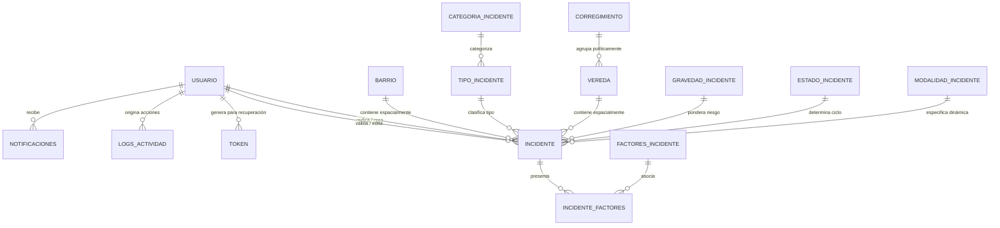

# MANUAL TÉCNICO DE ARQUITECTURA Y DESARROLLO
## Sistema de Información Geográfica de Incidentes — SIGI
**Guía para Administradores de Infraestructura, Ingenieros DevOps y Desarrolladores**

---

### Control del Documento
- **Proyecto:** SIGI - Sistema de Información Geográfica de Incidentes
- **Institución:** Servicio Nacional de Aprendizaje (SENA) — Regional Caquetá
- **Programa:** Análisis y Desarrollo de Software (ADSO) - Ficha 3142784
- **Autor Principal:** Daniel Felipe Vera Perdomo
- **Versión del Manual:** 2.0
- **Fecha:** Septiembre 2026
- **Ámbito:** Guía Técnica de Mantenimiento, Despliegue, APIs y Base de Datos

---

## ÍNDICE GENERAL

1. [INTRODUCCIÓN Y ARQUITECTURA GENERAL](#1-introducción-y-arquitectura-general)  
   1.1 [Propósito del Manual Técnico](#11-propósito-del-manual-técnico)  
   1.2 [Estructura del Proyecto y Directorios](#12-estructura-del-proyecto-y-directorios)  
2. [DISEÑO Y ESPECIFICACIÓN DE BASE DE DATOS (POSTGRESQL + POSTGIS)](#2-diseño-y-especificación-de-base-de-datos-postgresql--postgis)  
   2.1 [Diagrama Entidad-Relación Extendido](#21-diagrama-entidad-relación-extendido)  
   2.2 [Diccionario Exhaustivo de Tablas](#22-diccionario-exhaustivo-de-tablas)  
   2.3 [Lógica Geoespacial y Consultas Topológicas (ST_Contains, GiST)](#23-lógica-geoespacial-y-consultas-topológicas-st_contains-gist)  
   2.4 [Scripts de Inicialización y Migraciones](#24-scripts-de-inicialización-y-migraciones)  
3. [ARQUITECTURA BACKEND (NODE.JS & EXPRESS 5)](#3-arquitectura-backend-nodejs--express-5)  
   3.1 [Ciclo de Vida de una Petición y Cadena de Middlewares](#31-ciclo-de-vida-de-una-petición-y-cadena-de-middlewares)  
   3.2 [Control de Acceso Basado en Roles (RBAC) y Sesiones](#32-control-de-acceso-basado-en-roles-rbac-y-sesiones)  
   3.3 [Mecanismo de Bloqueo Concurrente (Locking) en la Mesa de Validación](#33-mecanismo-de-bloqueo-concurrente-locking-en-la-mesa-de-validación)  
   3.4 [Ingesta Masiva CSV con Rollback Atómico](#34-ingesta-masiva-csv-con-rollback-atómico)  
4. [SERVICIOS AUXILIARES E INTEGRACIONES](#4-servicios-auxiliares-e-integraciones)  
   4.1 [Integración Multimedia con Cloudinary (Upload Streaming & Fallback)](#41-integración-multimedia-con-cloudinary-upload-streaming--fallback)  
   4.2 [Servicio Transaccional de Correo (Nodemailer SMTP & Simulador)](#42-servicio-transaccional-de-correo-nodemailer-smtp--simulador)  
   4.3 [Módulo Centralizado de Auditoría (Logger Forense)](#43-módulo-centralizado-de-auditoría-logger-forense)  
5. [CATÁLOGO DE ENDPOINTS Y API REST](#5-catálogo-de-endpoints-y-api-rest)  
   5.1 [Autenticación y Seguridad (`/api/auth`)](#51-autenticación-y-seguridad-apiauth)  
   5.2 [Geografía y Cartografía (`/api/geografia`)](#52-geografía-y-cartografía-apigeografia)  
   5.3 [Gestión de Incidentes y Flujo de Validación (`/api/incidentes`)](#53-gestión-de-incidentes-y-flujo-de-validación-apiincidentes)  
   5.4 [Administración y Gobernanza de Usuarios (`/api/usuarios`)](#54-administración-y-gobernanza-de-usuarios-apiusuarios)  
   5.5 [Estadísticas y Analítica KPI (`/api/estadisticas`)](#55-estadísticas-y-analítica-kpi-apiestadisticas)  
6. [GUÍA DE INSTALACIÓN, CONFIGURACIÓN Y DESPLIEGUE](#6-guía-de-instalación-configuración-y-despliegue)  
   6.1 [Requisitos Previos del Sistema Operativo](#61-requisitos-previos-del-sistema-operativo)  
   6.2 [Configuración Paso a Paso en Entorno Local](#62-configuración-paso-a-paso-en-entorno-local)  
   6.3 [Despliegue en Producción (Linux / PM2 / Nginx Reverse Proxy)](#63-despliegue-en-producción-linux--pm2--nginx-reverse-proxy)  
7. [PLAN DE PRUEBAS AUTOMATIZADAS (JEST & SUPERTEST)](#7-plan-de-pruebas-automatizadas-jest--supertest)  
   7.1 [Configuración de Pruebas](#71-configuración-de-pruebas)  
   7.2 [Ejecución de Pruebas y Cobertura de Código](#72-ejecución-de-pruebas-y-cobertura-de-código)  

---

## 1. INTRODUCCIÓN Y ARQUITECTURA GENERAL

### 1.1 Propósito del Manual Técnico
Este documento proporciona toda la información de bajo nivel requerida para comprender, desplegar, extender, depurar y asegurar el **Sistema de Información Geográfica de Incidentes (SIGI)**. Está concebido para ingenieros de desarrollo, administradores de bases de datos (DBA) y evaluadores del SENA.

### 1.2 Estructura del Proyecto y Directorios
El proyecto adopta el patrón modular de arquitectura MVC orientada a APIs:

```
SIGI/
├── config/                  # Configuraciones de conexión a BD y servicios
│   └── db.config.js         # Parámetros de conexión PostgreSQL desde .env
├── controllers/             # Controladores de lógica de negocio
│   ├── auth.controller.js
│   ├── autocompletado.controller.js
│   ├── catalogos.controller.js
│   ├── estadisticas.controller.js
│   ├── filtros.controller.js
│   ├── geografia.controller.js
│   ├── incidentes.controller.js
│   ├── tablas.controller.js
│   └── usuarios.controller.js
├── middleware/              # Filtros de seguridad, autenticación y errores
│   ├── auth.middleware.js   # Guards de sesión, RBAC y estado activo
│   └── error.middleware.js  # Manejo centralizado de excepciones HTTP
├── routes/                  # Definición de rutas y endpoints de la API
│   ├── auth.routes.js
│   ├── autocompletado.routes.js
│   ├── catalogos.routes.js
│   ├── estadisticas.routes.js
│   ├── filtros.routes.js
│   ├── geografia.routes.js
│   ├── incidentes.routes.js
│   ├── tablas.routes.js
│   └── usuarios.routes.js
├── sql/                     # Scripts de estructura DDL, DML y migraciones
│   ├── schema.sql           # Esquema base con PostGIS
│   ├── migration_v2.sql     # Migración integral V2 (RBAC, estados, gravedad)
│   ├── migration_falta.sql  # Control de cambio de contraseña y tokens
│   └── migrate_passwords.sql
├── utils/                   # Módulos transversales utilitarios
│   ├── cloudinary.js        # Integración SDK Cloudinary + fallback local
│   ├── logger.js            # Inserción en logs_actividad
│   └── mailer.js            # Servicio SMTP Nodemailer + simulador dev
├── public/                  # Archivos estáticos de frontend (HTML/CSS/JS)
│   ├── css/                 # Hojas de estilo modulares
│   ├── js/                  # Scripts clientes asíncronos y mapas Leaflet
│   └── dashboard/           # Vistas administrativas y públicas
├── tests/                   # Suite de pruebas automatizadas (Jest/Supertest)
├── db.js                    # Inicialización del Pool de conexiones pg
├── server.js                # Punto de entrada Express y configuración HTTP
├── package.json             # Manifiesto de dependencias y scripts de ejecución
└── .env                     # Variables de entorno confidenciales
```

---

## 2. DISEÑO Y ESPECIFICACIÓN DE BASE DE DATOS (POSTGRESQL + POSTGIS)

### 2.1 Diagrama Entidad-Relación Extendido



> **ESPACIO PARA DIAGRAMA:**  
> *(Insertar aquí Diagrama Entidad-Relación Detallado de la Base de Datos PostGIS de SIGI)*

### 2.2 Diccionario Exhaustivo de Tablas

#### Tabla: `incidente` (Tabla Central del Negocio)
| Columna | Tipo de Dato | Restricción | Descripción |
| :--- | :--- | :--- | :--- |
| `idincidente` | `SERIAL` | `PK` | Identificador único secuencial del registro. |
| `codigoincidente` | `VARCHAR(50)` | `UNIQUE, NOT NULL` | Código alfanumérico público de radicado (ej: `INC-482910`). |
| `descripcionincidente` | `TEXT` | `NOT NULL` | Relato detallado de los hechos ocurridos. |
| `fechaincidente` | `DATE` | `NOT NULL` | Fecha de materialización del evento. |
| `horaincidente` | `TIME` | `NOT NULL` | Hora registrada del suceso. |
| `geom` | `geometry(Point, 4326)` | `NOT NULL` | Objeto geométrico del punto espacial (Longitud, Latitud WGS84). |
| `idtipoincidente` | `INTEGER` | `FK -> tipo_incidente` | Categoría tipológica del evento. |
| `id_gravedad` | `INTEGER` | `FK -> gravedad_incidente` | Nivel de severidad (1: Muy baja a 5: Crítica). |
| `id_estado` | `INTEGER` | `FK -> estado_incidente` | Estado del incidente (1: Reportado, 5: Resuelto, etc.). |
| `id_modalidad` | `INTEGER` | `FK -> modalidad_incidente` | Modalidad de comisión (arma de fuego, cortopunzante, etc.). |
| `idbarrio` | `INTEGER` | `FK -> barrio(gid)` | Identificador del barrio asignado por contención espacial. |
| `idvereda` | `INTEGER` | `FK -> vereda(id)` | Identificador de la vereda asignada por contención espacial. |
| `direccion` | `TEXT` | `NULL` | Nomenclatura urbana o referencia descriptiva del lugar. |
| `imagen_url` | `TEXT` | `NULL` | Enlace seguro HTTPS hacia la evidencia en Cloudinary. |
| `idusuario` | `INTEGER` | `FK -> usuario` | Identificador del usuario que registró el reporte. |
| `id_usuario_creador` | `INTEGER` | `FK -> usuario` | Auditoría de creación original. |
| `id_usuario_editor` | `INTEGER` | `FK -> usuario` | Último usuario que modificó o validó el incidente. |
| `id_admin_revisor` | `INTEGER` | `FK -> usuario` | Administrador que emitió el dictamen de validación. |
| `locked_by` | `INTEGER` | `FK -> usuario` | ID del analista que tiene bloqueado el caso en la cola. |
| `locked_at` | `TIMESTAMP` | `NULL` | Marca de tiempo del bloqueo (caduca a los 10 minutos). |
| `origen` | `VARCHAR(20)` | `DEFAULT 'manual'` | Fuente de los datos (`'manual'`, `'movil'`, `'importacion'`). |
| `lote_importacion` | `VARCHAR(50)` | `NULL` | Hash o marca de lote de importación masiva para rollback. |

#### Tabla: `usuario`
| Columna | Tipo | Restricción | Descripción |
| :--- | :--- | :--- | :--- |
| `idusuario` | `SERIAL` | `PK` | ID interno del usuario. |
| `nombreusuario` | `VARCHAR(50)` | `UNIQUE, NOT NULL` | Nombre de acceso único al sistema. |
| `contraseniausuario`| `VARCHAR(255)` | `NOT NULL` | Hash Bcrypt (10 rondas de costo) de la clave. |
| `email` | `VARCHAR(150)` | `UNIQUE, NOT NULL` | Correo electrónico para notificaciones y token. |
| `rol` | `VARCHAR(20)` | `DEFAULT 'reportero'` | Rol RBAC: `superadmin`, `admin`, `reportero`. |
| `estado` | `VARCHAR(20)` | `DEFAULT 'activo'` | Estado operativo: `activo`, `inactivo`, `suspendido`. |
| `entidadusuario` | `VARCHAR(100)` | `NOT NULL` | Dependencia o institución (Policía, Alcaldía, SENA). |
| `debe_cambiar_password` | `BOOLEAN` | `DEFAULT false` | Flag que fuerza cambio de contraseña en login. |
| `ultimo_acceso` | `TIMESTAMP` | `NULL` | Registro de auditoría del último inicio de sesión. |

#### Tabla: `logs_actividad`
Almacena la bitácora inmutable de eventos sensibles:
- `id_log`: Serial PK.
- `id_usuario`: FK al usuario responsable.
- `accion`: Tipo de operación (`CREACION_INCIDENTE`, `BLOQUEO_LOCK`, `APROBACION`, `IMPORTACION_MASIVA`, etc.).
- `tabla_afectada`: Nombre de la tabla modificada.
- `id_registro`: ID de la entidad involucrada.
- `descripcion`: Resumen legible del cambio.
- `ip`: Dirección IP del solicitante.
- `user_agent`: Cabecera del navegador cliente.
- `fecha`: Timestamp automático con zona horaria.

---

### 2.3 Lógica Geoespacial y Consultas Topológicas (ST_Contains, GiST)

Una de las innovaciones nucleares de SIGI es la **autolocalización topológica**. Cuando un usuario radica un incidente con latitud y longitud, el servidor no le exige al usuario saber a qué barrio o vereda pertenece; el motor de base de datos lo calcula automáticamente mediante la función espacial `ST_Contains`:

```sql
-- Detección automática del Barrio Urbano en PostGIS:
SELECT gid FROM barrio 
WHERE ST_Contains(geom, ST_SetSRID(ST_MakePoint($1, $2), 4326)) 
LIMIT 1;

-- Detección automática de la Vereda Rural:
SELECT id FROM vereda 
WHERE ST_Contains(geom, ST_SetSRID(ST_MakePoint($1, $2), 4326)) 
LIMIT 1;
```

#### Indexación GiST para Rendimiento Sub-Segundo:
Para evitar escaneos secuenciales que degradarían el sistema al manejar geometrías poligonales complejas, se crearon índices basados en árboles de búsqueda generalizada (*GiST*):
```sql
CREATE INDEX idx_incidente_geom ON incidente USING GIST (geom);
CREATE INDEX idx_barrio_geom ON barrio USING GIST (geom);
CREATE INDEX idx_vereda_geom ON vereda USING GIST (geom);
```

---

## 3. ARQUITECTURA BACKEND (NODE.JS & EXPRESS 5)

### 3.1 Ciclo de Vida de una Petición y Cadena de Middlewares
Cada petición HTTP entrante recorre una tubería (*pipeline*) de seguridad antes de alcanzar los controladores:

```
[Cliente HTTP] 
      │ (Petición)
      ▼
1. Helmet Middleware (Aplica directivas de cabeceras seguras)
      ▼
2. Express-Rate-Limit (Valida cuota de peticiones por IP)
      ▼
3. Body Parsers (express.json() y multer en memoria si es multipart)
      ▼
4. Express-Session (Deserializa cookie de sesión firmada)
      ▼
5. Route Guard: verificarSesion (Valida idusuario en sesión)
      ▼
6. Route Guard: verificarEstadoActivo (Comprueba que el usuario no esté suspendido)
      ▼
7. Route Guard: verificarRol('admin', 'superadmin') (Valida privilegios RBAC)
      ▼
8. Controller Execution (Transacción SQL parametrizada)
      ▼
9. Centralized Error Handler (Captura excepciones y responde JSON controlado)
```

> **ESPACIO PARA DIAGRAMA:**  
> *(Insertar aquí Diagrama de Flujo del Pipeline de Middlewares en Express)*

---

### 3.2 Control de Acceso Basado en Roles (RBAC) y Sesiones
El archivo `middleware/auth.middleware.js` implementa los inspectores de autorización:
```javascript
const verificarSesion = (req, res, next) => {
  if (req.session && req.session.idusuario) {
    return next();
  }
  return res.status(401).json({ mensaje: "Sesión no válida o expirada. Por favor inicie sesión 🔒" });
};

const verificarRol = (...rolesPermitidos) => {
  return (req, res, next) => {
    const rolUsuario = req.session.rol;
    if (!rolUsuario || !rolesPermitidos.includes(rolUsuario)) {
      return res.status(403).json({ mensaje: "Acceso denegado: Privilegios insuficientes 🚫" });
    }
    next();
  };
};
```

---

### 3.3 Mecanismo de Bloqueo Concurrente (Locking) en la Mesa de Validación
Para evitar que dos administradores revisen, editen o dictaminen sobre el mismo reporte a la vez, se implementó el protocolo de **Candado Temporal con Auto-Expiración**:

1. **Adquisición del Bloqueo (`/api/incidentes/:id/tomar`):**
   ```sql
   UPDATE incidente 
   SET locked_by = $1, locked_at = CURRENT_TIMESTAMP 
   WHERE idincidente = $2 
     AND (locked_by IS NULL OR locked_by = $1 OR locked_at < NOW() - INTERVAL '10 minutes')
   RETURNING idincidente;
   ```
2. **Resultado Atómico:** Si la consulta actualiza una fila, el bloqueo fue otorgado. Si retorna cero filas, significa que otro analista ya tomó el control del caso y aún no ha vencido su ventana de 10 minutos.
3. **Liberación del Bloqueo:** Al dictaminar (aprobar o desestimar) o al hacer clic en "Liberar Caso", se ejecuta:
   ```sql
   UPDATE incidente SET locked_by = NULL, locked_at = NULL WHERE idincidente = $1;
   ```

---

### 3.4 Ingesta Masiva CSV con Rollback Atómico
La importación masiva en `incidentes.controller.js` utiliza la librería `csv-parser` procesando el fichero mediante flujos (*streams*) en memoria:
- Cada fila es analizada validando: formato de fecha `YYYY-MM-DD`, hora `HH:MM`, coordenadas numéricas válidas en rango de Florencia y tipo de incidente existente.
- A todo el bloque importado se le asigna un identificador de lote: `lote_importacion = 'LOTE_' + Date.now()`.
- **Rollback Inmediato:** Mediante el endpoint `DELETE /api/incidentes/importados/ultimo`, el administrador puede deshacer la última carga masiva sin afectar registros previos:
  ```sql
  DELETE FROM incidente 
  WHERE lote_importacion = (SELECT lote_importacion FROM incidente WHERE lote_importacion IS NOT NULL ORDER BY idincidente DESC LIMIT 1);
  ```

---

## 4. SERVICIOS AUXILIARES E INTEGRACIONES

### 4.1 Integración Multimedia con Cloudinary (Upload Streaming & Fallback)
El módulo `utils/cloudinary.js` implementa carga segura en la nube:
- Se evita la escritura en disco del servidor usando buffers directos de `multer.memoryStorage`.
- La imagen se procesa con el SDK oficial v2 de Cloudinary utilizando DataURIs en Base64.
- **Tolerancia a Fallos (Fallback):** Si los servicios de Cloudinary no están configurados o fallan, el módulo conmuta transparentemente guardando el archivo en `public/uploads/incidentes/` con nombres únicos basados en timestamp para garantizar que la operación nunca se detenga.

### 4.2 Servicio Transaccional de Correo (Nodemailer SMTP & Simulador)
El componente `utils/mailer.js` ofrece soporte para servidores SMTP empresariales (Gmail, SendGrid, Amazon SES) con cifrado SSL/TLS.
- **Entorno de Pruebas:** Si no se suministran credenciales SMTP en el `.env`, el sistema activa el **Modo Simulador**, imprimiendo los correos, asuntos y tokens de acceso directamente en la consola del servidor sin lanzar excepciones.

---

## 5. CATÁLOGO DE ENDPOINTS Y API REST

### 5.1 Autenticación y Seguridad
- `POST /api/auth/login`: Autentica credenciales y establece la sesión.
- `POST /api/auth/logout`: Destruye la sesión activa y limpia cookies.
- `GET /api/auth/perfil`: Retorna los datos del usuario en sesión actual.
- `POST /api/auth/cambiar-password-obligatorio`: Actualiza la contraseña en el primer inicio de sesión.
- `POST /api/auth/solicitar-recuperacion`: Genera token de reseteo y despacha correo.
- `POST /api/auth/reset-password`: Aplica nueva clave validando el token criptográfico.

### 5.2 Geografía y Mapas
- `GET /api/geografia/barrios`: Retorna GeoJSON con los polígonos de todos los barrios urbanos.
- `GET /api/geografia/veredas`: Retorna GeoJSON con los polígonos de todas las veredas rurales.

### 5.3 Gestión de Incidentes
- `GET /api/incidentes`: Consulta pública y filtrada de incidentes (GeoJSON / Array JSON).
- `GET /api/incidentes/pendientes`: Retorna los casos en cola de validación (Solo Admin/Superadmin).
- `GET /api/incidentes/mis-reportes`: Retorna el historial de novedades del reportero autenticado.
- `POST /api/incidentes`: Registra un nuevo incidente con soporte de foto multipart.
- `POST /api/incidentes/:id/tomar`: Adquiere el candado concurrente de revisión (10 min).
- `POST /api/incidentes/:id/liberar`: Libera voluntariamente el candado de revisión.
- `POST /api/incidentes/:id/resolver`: Dictamina caso como aprobado/resuelto.
- `POST /api/incidentes/:id/cerrar`: Desestima caso con justificación técnica.
- `POST /api/importar-incidentes`: Ingesta masiva mediante fichero CSV.
- `DELETE /api/incidentes/importados/ultimo`: Revierte (*rollback*) el último lote importado.

### 5.4 Gobernanza de Usuarios
- `GET /api/usuarios`: Listado completo de usuarios registrados (Superadmin).
- `POST /api/usuarios`: Creación de usuario, generación de clave aleatoria y despacho de correo.
- `PUT /api/usuarios/:id/estado`: Cambio de estado (`activo`, `inactivo`, `suspendido`).
- `GET /api/auditoria/logs`: Consulta paginada y filtrable de la bitácora `logs_actividad`.

---

## 6. GUÍA DE INSTALACIÓN, CONFIGURACIÓN Y DESPLIEGUE

### 6.1 Requisitos Previos del Sistema Operativo
- Node.js v20.x o superior instalado globalmente.
- PostgreSQL v15+ con extensión espacial PostGIS activada.
- Git para control de versiones.

### 6.2 Configuración Paso a Paso en Entorno Local
1. **Clonar el repositorio:**
   ```bash
   git clone https://github.com/tu-usuario/SIGI.git
   cd SIGI
   ```
2. **Instalar dependencias:**
   ```bash
   npm install
   ```
3. **Crear y configurar la base de datos:**
   ```bash
   # En terminal psql:
   CREATE DATABASE db_mapeo;
   \c db_mapeo
   CREATE EXTENSION postgis;
   ```
4. **Ejecutar migraciones en orden:**
   ```bash
   psql -U postgres -d db_mapeo -f sql/schema.sql
   psql -U postgres -d db_mapeo -f sql/migration_v2.sql
   psql -U postgres -d db_mapeo -f sql/migration_falta.sql
   ```
5. **Configurar variables de entorno (`.env`):**
   ```env
   PORT=3000
   DB_USER=postgres
   DB_HOST=localhost
   DB_NAME=db_mapeo
   DB_PASSWORD=tu_password
   DB_PORT=5432
   SESSION_SECRET=clave_secreta_super_segura_de_produccion_2026
   ```
6. **Iniciar servidor en modo desarrollo:**
   ```bash
   npm run dev
   ```

---

## 7. PLAN DE PRUEBAS AUTOMATIZADAS (JEST & SUPERTEST)

### 7.1 Configuración de Pruebas
Las pruebas se definen en el directorio `tests/` utilizando **Jest** y **Supertest** para simular peticiones HTTP reales sobre la API de Express sin necesidad de abrir un navegador web.

### 7.2 Ejecución de Pruebas y Cobertura de Código
Para ejecutar la suite completa de pruebas automatizadas:
```bash
npm test
```
El ejecutor generará en consola la tabla de resultados con cobertura de código (*Code Coverage*) para las ramas de control de acceso, verificación de credenciales y endpoints geográficos.
