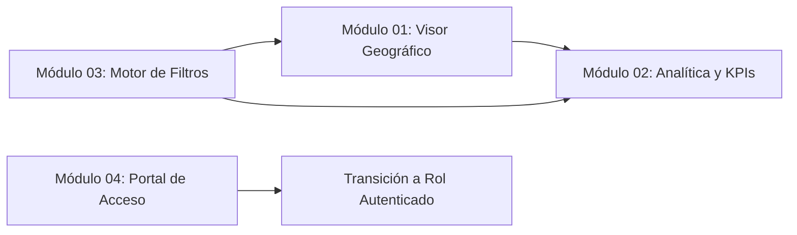

# Documentación del Rol: Invitado (Público General)

El rol **Invitado** representa a los ciudadanos, líderes comunitarios o visitantes que acceden a SIGI sin necesidad de credenciales de acceso privadas. Su objetivo principal es la consulta transparente de información sobre seguridad ciudadana y la interacción segura para iniciar sesión o recuperar cuentas.

---

## 🗺️ Mapa de Módulos y Dependencias

---

## 📚 Índice de Módulos y Diagramas

| Módulo | Descripción Técnica | Diagrama Asociado |
| :--- | :--- | :--- |
| **[Módulo 01: Visor Geográfico Público](01_visor_geografico_publico.md)** | Cartografía abierta con Leaflet, clústeres por gravedad y popups informativos sanitizados. | [`diagramas/01_visor_geografico_publico.drawio`](diagramas/01_visor_geografico_publico.drawio) |
| **[Módulo 02: Analítica y Tableros KPI](02_analitica_kpis_ciudadanos.md)** | Estadísticas agregadas, top 5 zonas críticas, distribución por delito (Chart.js) y fecha de actualización. | [`diagramas/02_analitica_kpis_ciudadanos.drawio`](diagramas/02_analitica_kpis_ciudadanos.drawio) |
| **[Módulo 03: Motor de Filtros Espacio-Temporal](03_filtros_interactivos_mapa.md)** | Búsqueda por barrios, filtrado por fechas, gravedad y tipología con debounce. | [`diagramas/03_filtros_interactivos_mapa.drawio`](diagramas/03_filtros_interactivos_mapa.drawio) |
| **[Módulo 04: Portal de Acceso y Gestión de Identidad](04_autenticacion_recuperacion_clave.md)** | Login seguro, rate limiting contra fuerza bruta, recuperación con tokens criptográficos por correo y cambio obligatorio de clave. | [`diagramas/04_autenticacion_recuperacion_clave.drawio`](diagramas/04_autenticacion_recuperacion_clave.drawio) |

---

## 🔒 Consideraciones de Seguridad para el Rol Invitado
1. **Privacidad de Datos Personales (Habeas Data):** Las consultas ciudadanas nunca exponen nombres, identificaciones ni datos de contacto de víctimas o denunciantes.
2. **Filtrado Exclusivo:** La base de datos solo retorna registros con `estado = 'Aprobado'`.
3. **Protección Perimetral:** Endpoints protegidos mediante `express-rate-limit` para evitar DoS o scraping excesivo.
