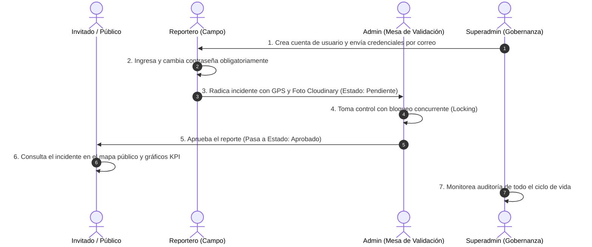

# Documentación Técnica Integral — SIGI (Sistema de Información Geográfica de Incidentes)

Bienvenido a la documentación oficial del sistema **SIGI**, estructurada por perfiles de usuario (**Roles**) para garantizar claridad técnica, coherencia funcional y trazabilidad de los flujos de información y seguridad.

---

## 🧭 Matriz de Navegación por Rol

```
documentacion/
├── Invitado/                     # Ciudadanía y usuarios no autenticados
│   ├── README.md                 # Índice y mapa funcional del Invitado
│   ├── 01_visor_geografico_publico.md
│   ├── 02_analitica_kpis_ciudadanos.md
│   ├── 03_filtros_interactivos_mapa.md
│   ├── 04_autenticacion_recuperacion_clave.md
│   └── diagramas/                # 4 Diagramas en formato .drawio
├── Reportero/                    # Agentes de campo y cuadrantes móviles
│   ├── README.md                 # Índice y mapa funcional del Reportero
│   ├── 01_captura_incidente_gps.md
│   ├── 02_mis_reportes_seguimiento.md
│   ├── 03_sesion_seguridad_movil.md
│   └── diagramas/                # 3 Diagramas en formato .drawio
├── Admin/                        # Analistas de seguridad y validadores de incidentes
│   ├── README.md                 # Índice y mapa funcional del Administrador
│   ├── 01_cola_compartida_validacion.md
│   ├── 02_registro_gestion_incidentes.md
│   ├── 03_importacion_masiva_datos.md
│   ├── 04_tablas_filtros_avanzados.md
│   └── diagramas/                # 4 Diagramas en formato .drawio
└── Superadmin/                   # Administrador general del sistema y gobernanza
    ├── README.md                 # Índice y mapa funcional del Superadmin
    ├── 01_gestion_usuarios.md
    ├── 02_auditoria_seguridad.md
    ├── 03_gobernanza_sistema.md
    └── diagramas/                # 3 Diagramas en formato .drawio
```

---

## 👥 Matriz de Roles y Permisos (RBAC)

| Módulo / Funcionalidad | Invitado | Reportero | Admin | Superadmin |
| :--- | :---: | :---: | :---: | :---: |
| **Visor Geográfico Público** | ✅ Lectura | ✅ Lectura | ✅ Lectura | ✅ Lectura |
| **Tableros Analíticos y KPIs** | ✅ Lectura | ✅ Lectura | ✅ Lectura | ✅ Lectura |
| **Motor de Filtros Espacio-Temporal** | ✅ Activo | ✅ Activo | ✅ Activo | ✅ Activo |
| **Autenticación y Recuperación** | ✅ Autoservicio | ✅ Autoservicio | ✅ Autoservicio | ✅ Autoservicio |
| **Captura en Terreno (GPS + Cloudinary)** | ❌ | ✅ Completo | ✅ Completo | ✅ Completo |
| **Mis Reportes y Seguimiento** | ❌ | ✅ Propios | ✅ Propios | ✅ Propios |
| **Mesa de Validación (Cola Compartida / Lock)** | ❌ | ❌ | ✅ Completo | ✅ Completo |
| **Registro y Edición Administrativa** | ❌ | ❌ | ✅ Completo | ✅ Completo |
| **Importación Masiva y Rollback** | ❌ | ❌ | ✅ Completo | ✅ Completo |
| **Explorador Tabular y Filtros Admin** | ❌ | ❌ | ✅ Completo | ✅ Completo |
| **Gestión de Usuarios (CRUD + Correos)** | ❌ | ❌ | ❌ | ✅ Exclusivo |
| **Bitácora de Auditoría y Trazabilidad** | ❌ | ❌ | ❌ | ✅ Exclusivo |
| **Gobernanza y Políticas Globales** | ❌ | ❌ | ❌ | ✅ Exclusivo |

---

## 🔄 Flujo de Información Transversal entre Roles



---

## 📊 Diagramas de Arquitectura y Flujo (.drawio)

Todos los diagramas han sido generados en formato XML estándar de **[Diagrams.net (Draw.io)](https://app.diagrams.net/)** y pueden abrirse directamente con la extensión de Draw.io en VS Code o en la herramienta web:

1. **Rol Invitado:**
   - [`Invitado/diagramas/01_visor_geografico_publico.drawio`](Invitado/diagramas/01_visor_geografico_publico.drawio)
   - [`Invitado/diagramas/02_analitica_kpis_ciudadanos.drawio`](Invitado/diagramas/02_analitica_kpis_ciudadanos.drawio)
   - [`Invitado/diagramas/03_filtros_interactivos_mapa.drawio`](Invitado/diagramas/03_filtros_interactivos_mapa.drawio)
   - [`Invitado/diagramas/04_autenticacion_recuperacion_clave.drawio`](Invitado/diagramas/04_autenticacion_recuperacion_clave.drawio)
2. **Rol Reportero:**
   - [`Reportero/diagramas/01_captura_incidente_gps.drawio`](Reportero/diagramas/01_captura_incidente_gps.drawio)
   - [`Reportero/diagramas/02_mis_reportes_seguimiento.drawio`](Reportero/diagramas/02_mis_reportes_seguimiento.drawio)
   - [`Reportero/diagramas/03_sesion_seguridad_movil.drawio`](Reportero/diagramas/03_sesion_seguridad_movil.drawio)
3. **Rol Admin:**
   - [`Admin/diagramas/01_cola_compartida_validacion.drawio`](Admin/diagramas/01_cola_compartida_validacion.drawio)
   - [`Admin/diagramas/02_registro_gestion_incidentes.drawio`](Admin/diagramas/02_registro_gestion_incidentes.drawio)
   - [`Admin/diagramas/03_importacion_masiva_datos.drawio`](Admin/diagramas/03_importacion_masiva_datos.drawio)
   - [`Admin/diagramas/04_tablas_filtros_avanzados.drawio`](Admin/diagramas/04_tablas_filtros_avanzados.drawio)
4. **Rol Superadmin:**
   - [`Superadmin/diagramas/01_gestion_usuarios.drawio`](Superadmin/diagramas/01_gestion_usuarios.drawio)
   - [`Superadmin/diagramas/02_auditoria_seguridad.drawio`](Superadmin/diagramas/02_auditoria_seguridad.drawio)
   - [`Superadmin/diagramas/03_gobernanza_sistema.drawio`](Superadmin/diagramas/03_gobernanza_sistema.drawio)
