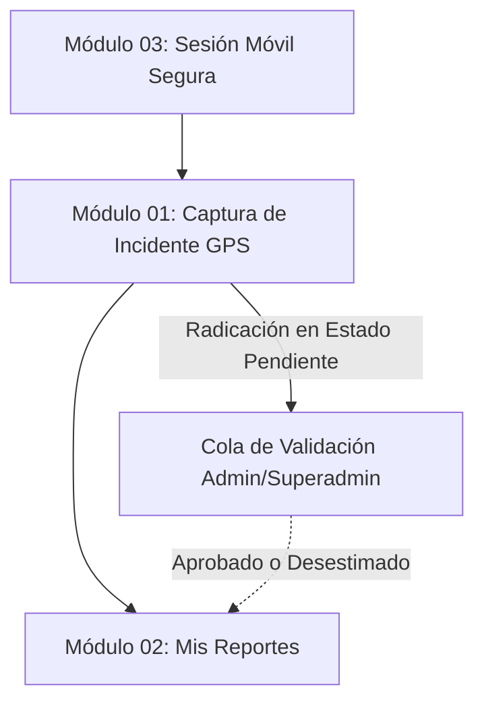

# Documentación del Rol: Reportero (Agente de Campo)

El rol **Reportero** está diseñado para funcionarios de seguridad, patrulleros, cuadrantes o líderes barriales que operan directamente en territorio capturando incidentes en tiempo real mediante dispositivos móviles.

---

## 📱 Flujo Operativo y Dependencias

---

## 📚 Índice de Módulos y Diagramas

| Módulo | Descripción Técnica | Diagrama Asociado |
| :--- | :--- | :--- |
| **[Módulo 01: Captura de Incidentes en Terreno](01_captura_incidente_gps.md)** | GPS 1-clic con minimapa, formulario estandarizado y subida de fotos a Cloudinary con respaldo local. | [`diagramas/01_captura_incidente_gps.drawio`](diagramas/01_captura_incidente_gps.drawio) |
| **[Módulo 02: Mis Reportes y Seguimiento](02_mis_reportes_seguimiento.md)** | Historial personal de hechos reportados, aislamiento de datos y visualización de insignias de estado. | [`diagramas/02_mis_reportes_seguimiento.drawio`](diagramas/02_mis_reportes_seguimiento.drawio) |
| **[Módulo 03: Sesión Móvil y Seguridad en Campo](03_sesion_seguridad_movil.md)** | Temporizador de inactividad de 40 min, aviso a los 38 min, auto-logout y cookies httpOnly/rolling. | [`diagramas/03_sesion_seguridad_movil.drawio`](diagramas/03_sesion_seguridad_movil.drawio) |

---

## 🛡️ Controles de Acceso y Aislamiento
- **RBAC:** El reportero solo tiene permiso sobre `/reportero`, `/api/incidentes` (POST) y `/api/incidentes/mis-reportes` (GET).
- **Prohibición de Acceso Administrativo:** Si un reportero intenta navegar a `/admin` o invocar endpoints de validación o usuarios, el middleware `verificarRol` emite de inmediato un código HTTP `403 Forbidden`.
