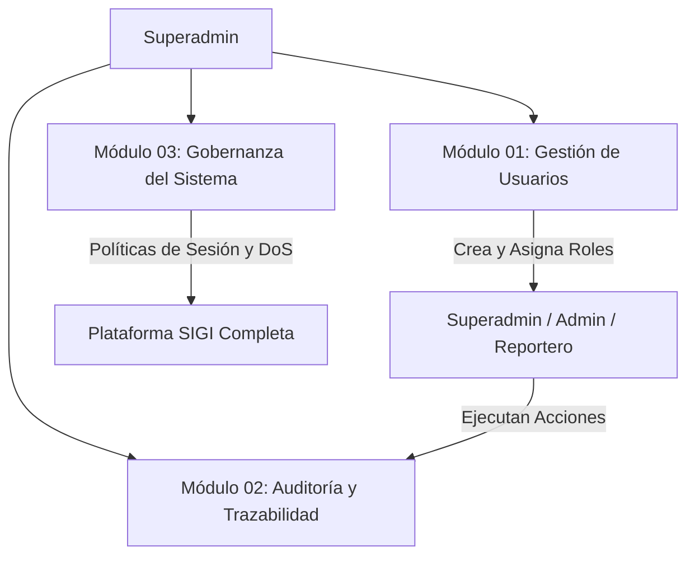

# Documentación del Rol: Superadmin (Gobernanza y Seguridad)

El rol **Superadmin** posee la máxima jerarquía técnica y operativa en SIGI. Tiene acceso irrestricto a todas las funciones del rol **Admin**, complementadas con los módulos de gobierno institucional, gestión de identidades, auditoría de seguridad y administración de infraestructura.

---

## 👑 Flujo de Gobierno y Dependencias



---

## 📚 Índice de Módulos y Diagramas

| Módulo | Descripción Técnica | Diagrama Asociado |
| :--- | :--- | :--- |
| **[Módulo 01: Gestión Integral de Usuarios y RBAC](01_gestion_usuarios.md)** | CRUD maestro de usuarios, correo de bienvenida con credenciales y obligatoriedad de primer cambio de clave. | [`diagramas/01_gestion_usuarios.drawio`](diagramas/01_gestion_usuarios.drawio) |
| **[Módulo 02: Auditoría y Trazabilidad Forense](02_auditoria_seguridad.md)** | Bitácora de accesos (`LOGIN_EXITOSO`, `FALLIDO`, `BLOQUEADO`), trazabilidad de cambios y metadatos de IP/User-Agent. | [`diagramas/02_auditoria_seguridad.drawio`](diagramas/02_auditoria_seguridad.drawio) |
| **[Módulo 03: Gobernanza del Sistema y Parámetros Globales](03_gobernanza_sistema.md)** | Políticas de sesión de 40 min, perimetral con Helmet y Rate Limiter, integración con Cloudinary, Gmail y PostGIS. | [`diagramas/03_gobernanza_sistema.drawio`](diagramas/03_gobernanza_sistema.drawio) |

---

## 🌟 Herencia Funcional
El **Superadmin** cuenta con autorización universal en el middleware `verificarRol`:
```javascript
if (rolUsuario === 'superadmin' || rolesPermitidos.includes(rolUsuario)) {
  return next();
}
```
Por tanto, puede acceder directamente a todos los módulos descritos en la documentación del rol **[Admin](../Admin/README.md)** (Mesa de validación, cola compartida, registro administrativo, importación masiva y cuadrículas de datos).
